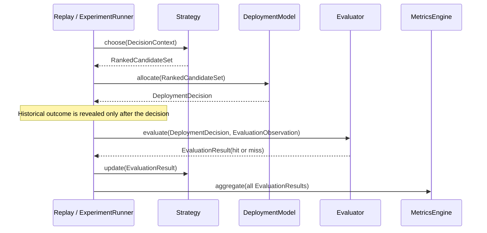
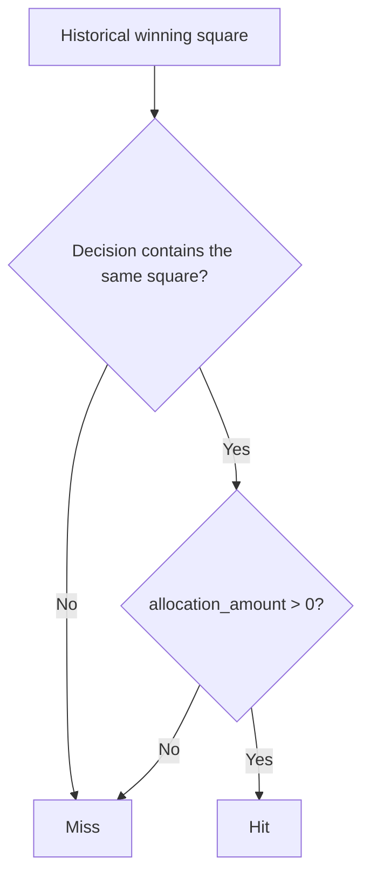

# Deployment Model and Evaluation Semantics Investigation

## Status

This document is a read-only design investigation of the current Strategy Lab
implementation. It describes existing behavior; it does not change or propose
changes to deployment, evaluation, replay, or production systems.

## Executive conclusion

The two built-in Deployment Models implement deterministic allocations over the
ordered candidates supplied by a strategy:

- `EqualWeightDeploymentModel` allocates an equal positive share of one abstract
  unit to every ranked candidate.
- `TopRankedDeploymentModel` allocates the full abstract unit to only the first
  ranked candidate.

The Evaluator defines a hit as the historical winning square having an
allocation whose `allocation_amount` is greater than zero. It does not compare
allocation magnitude, weight, rank, score, confidence, cost, or reward.

Consequently, an equal-weight decision covering all 25 squares necessarily
records a hit for every evaluated round. The built-in reference strategies all
rank all 25 squares, so pairing any of them with the equal-weight model produces
100% hit rate on evaluated rounds. This is the expected consequence of the
implemented Boolean coverage metric, not an Evaluator defect.

The implementation is internally deterministic and respects the architectural
separation between strategy, deployment, evaluation, and metrics. Hit rate
alone, however, does not measure allocation efficiency or economic performance.

## Sources and method

The conclusions below were traced through:

- the immutable deployment types and built-in models in
  [`deployment.py`](../../src/orev3/strategy_lab/deployment.py);
- factual per-round evaluation in
  [`evaluation.py`](../../src/orev3/strategy_lab/evaluation.py);
- pipeline orchestration in
  [`experiment.py`](../../src/orev3/strategy_lab/experiment.py);
- experiment aggregation in
  [`metrics.py`](../../src/orev3/strategy_lab/metrics.py);
- the three built-in reference strategies in
  [`strategies.py`](../../src/orev3/strategy_lab/strategies.py);
- focused deployment, evaluation, metrics, and end-to-end tests under
  [`tests/strategy_lab`](../../tests/strategy_lab);
- the architectural responsibilities in
  [`RFC-010`](../rfcs/RFC-010-STRATEGY-LAB.md).

## Deployment data model

`DeploymentAllocation` contains a square identifier, an allocation amount, an
allocation weight, and immutable metadata. Amount and weight must be finite and
nonnegative; weight cannot exceed one
([`deployment.py`, lines 17–46](../../src/orev3/strategy_lab/deployment.py#L17-L46)).

`DeploymentDecision` is an immutable ordered collection of allocations and
rejects duplicate square identifiers
([`deployment.py`, lines 49–80](../../src/orev3/strategy_lab/deployment.py#L49-L80)).
The general type does not require allocation amounts or weights to sum to one.
That normalization is a property of the two built-in models, not a universal
`DeploymentDecision` invariant.

The `DeploymentModel` interface describes its output as deterministic
deployment conviction
([`deployment.py`, lines 83–89](../../src/orev3/strategy_lab/deployment.py#L83-L89)).
RFC-010 likewise assigns Deployment Models the responsibility of expressing
conviction and separating allocation from strategy preference
([RFC-010, sections 7–8](../rfcs/RFC-010-STRATEGY-LAB.md#7-deployment-model)).

### What allocation represents

For the built-in models, allocation is a normalized share of an abstract
one-unit deployment:

- Equal Weight divides `1.0` by the number of candidates.
- Top Ranked assigns `1.0` to the first candidate.

The implementation does not attach a currency, miner count, transaction count,
or other physical denomination to `allocation_amount`. It also does not treat
allocation as probability: the values describe deployment conviction, while
RFC-010 explicitly states that strategy preference scores are ordering values,
not probabilities or capital allocations
([RFC-010, section 6.5](../rfcs/RFC-010-STRATEGY-LAB.md#65-ranked-candidate-set)).
The Evaluator never interprets allocation as confidence or expected reward.

Accordingly, the narrow implementation-backed description is:

> Allocation is an abstract deterministic unit allocation expressing a
> Deployment Model's conviction.

It is not, in the current implementation, a concrete amount of capital, number
of miners, probability, confidence score, or expected reward.

## Built-in Deployment Models

### EqualWeightDeploymentModel

For a nonempty set of \(N\) ranked candidates, Equal Weight computes
`share = 1.0 / N` and creates one allocation for every candidate. Both
`allocation_amount` and `allocation_weight` equal that share. Candidate order is
preserved, and rank is recorded in metadata
([`deployment.py`, lines 92–114](../../src/orev3/strategy_lab/deployment.py#L92-L114)).
An empty candidate set produces an empty decision.

| Question | Implemented answer |
| --- | --- |
| Positive allocations | \(N\), when \(N > 0\); otherwise 0 |
| Amount per candidate | \(1/N\) |
| Weight per candidate | \(1/N\) |
| Is every ranked candidate deployed? | Yes |
| Are scores or explanations used? | No |
| Allocation abstraction | Equal shares of one abstract deployment unit |

The focused test with candidates `(8, 2, 5)` confirms ordered allocations of
`(1/3, 1/3, 1/3)` summing to one
([`test_deployment.py`, lines 109–131](../../tests/strategy_lab/test_deployment.py#L109-L131)).
Another test confirms that changing preference scores and explanations without
changing candidate order does not change the allocation
([`test_deployment.py`, lines 134–161](../../tests/strategy_lab/test_deployment.py#L134-L161)).

#### Allocation examples

For ranked candidates `[8, 2, 5]`:

| Rank | Square | Allocation amount | Allocation weight |
| ---: | ---: | ---: | ---: |
| 1 | 8 | 0.333333… | 0.333333… |
| 2 | 2 | 0.333333… | 0.333333… |
| 3 | 5 | 0.333333… | 0.333333… |

For all 25 squares, every square receives a positive amount of `1/25 = 0.04`.

Equal Weight deploys every candidate in the supplied set. It deploys every
possible square only when the strategy supplies all 25 squares.

### TopRankedDeploymentModel

For a nonempty ranked set, Top Ranked selects `candidates[0]` and creates exactly
one allocation with amount `1.0` and weight `1.0`. All later candidates are
omitted. An empty candidate set produces an empty decision
([`deployment.py`, lines 117–138](../../src/orev3/strategy_lab/deployment.py#L117-L138)).

| Question | Implemented answer |
| --- | --- |
| Positive allocations | 1 for a nonempty set; otherwise 0 |
| Amount assigned | 1.0 to rank 1 |
| Weight assigned | 1.0 to rank 1 |
| Is every ranked candidate deployed? | No; only the first |
| Are score magnitude or explanations used? | No |
| Allocation abstraction | One abstract deployment unit concentrated on rank 1 |

The reference test confirms that candidates `[7, 2]` produce exactly one
allocation to square 7 with amount and weight `1.0`
([`test_reference_strategies.py`, lines 143–159](../../tests/strategy_lab/test_reference_strategies.py#L143-L159)).

#### Allocation example

For ranked candidates `[8, 2, 5]`:

| Rank | Square | Allocation amount | Allocation weight |
| ---: | ---: | ---: | ---: |
| 1 | 8 | 1.0 | 1.0 |
| 2 | 2 | not deployed | not deployed |
| 3 | 5 | not deployed | not deployed |

## Evaluation pipeline

The experiment wrapper keeps strategy choice, deployment, outcome revelation,
and evaluation in a strict order.



The implementation calls the strategy, validates its `RankedCandidateSet`, and
immediately asks the Deployment Model to allocate it
([`experiment.py`, lines 114–131](../../src/orev3/strategy_lab/experiment.py#L114-L131)).
Only during `update()` does it read the historical `winning_square`, create an
`EvaluationObservation`, and invoke the Evaluator
([`experiment.py`, lines 133–155](../../src/orev3/strategy_lab/experiment.py#L133-L155)).

This ordering means the finalized outcome is evaluation input, not strategy or
deployment input.

## Exact hit semantics

The Evaluator searches the decision for an allocation satisfying both:

1. `allocation.square_identifier == winning_square_identifier`; and
2. `allocation.allocation_amount > 0`.

If such an allocation exists, the result is a hit and that allocation becomes
`winning_allocation`. Otherwise, it is a miss
([`evaluation.py`, lines 62–104](../../src/orev3/strategy_lab/evaluation.py#L62-L104)).



The decision rule does not use:

- allocation weight;
- the magnitude of a positive allocation;
- strategy preference score;
- candidate rank;
- strategy explanation;
- deployment metadata;
- the number of other deployed squares.

Focused tests establish that a positive winning allocation is a hit, an absent
winning square is a miss, a zero-amount winning allocation is a miss, and an
empty decision is a miss
([`test_evaluation.py`, lines 38–93](../../tests/strategy_lab/test_evaluation.py#L38-L93)).

### One-round evaluation examples

Assume ranked candidates `[8, 2, 5]`.

#### Historical winner: square 2

- Equal Weight deploys positive amount `1/3` to square 2: **hit**.
- Top Ranked deploys only square 8: **miss**.

#### Historical winner: square 8

- Equal Weight deploys positive amount `1/3` to square 8: **hit**.
- Top Ranked deploys positive amount `1.0` to square 8: **hit**.

#### Historical winner: square 9

- Equal Weight over only `[8, 2, 5]`: **miss**.
- Top Ranked over `[8, 2, 5]`: **miss**.

These examples show that hit is a set-membership/positive-coverage fact. A
smaller positive allocation and the full unit are equivalent for hit
classification.

## Why Equal Weight can produce 100% hit rate

All three built-in reference strategies return all 25 square identifiers:

- `RandomStrategy` ranks `range(25)`
  ([`strategies.py`, lines 19–60](../../src/orev3/strategy_lab/strategies.py#L19-L60));
- `LeastCrowdedStrategy` sorts and returns `range(25)`
  ([`strategies.py`, lines 69–94](../../src/orev3/strategy_lab/strategies.py#L69-L94));
- `EqualDistributionStrategy` returns `range(25)` in canonical order
  ([`strategies.py`, lines 103–127](../../src/orev3/strategy_lab/strategies.py#L103-L127)).

Equal Weight therefore creates 25 positive allocations of `0.04`. An
`EvaluationObservation` accepts a winning square only in the inclusive range
0–24
([`evaluation.py`, lines 13–30](../../src/orev3/strategy_lab/evaluation.py#L13-L30)).
Every valid winner must consequently match one of those positive allocations.

Therefore:

```text
built-in strategy
  -> ranks all 25 squares
  -> Equal Weight allocates 0.04 to all 25 squares
  -> every valid winning square has allocation_amount > 0
  -> every evaluated round is a hit
  -> hit rate = 100%
```

This behavior is expected under the current implementation. A 100% hit rate
does not mean Equal Weight predicted the winner with certainty. It means the
deployment covered every possible winning square with a positive abstract
allocation.

## Is hit rate sufficient to compare Deployment Models?

No. The current hit rate is a Boolean coverage metric:

`hit_count / evaluation_count`

([`metrics.py`, lines 37–47](../../src/orev3/strategy_lab/metrics.py#L37-L47)).
The Metrics Engine counts a hit from each `EvaluationResult` and separately
counts how often each square received a positive allocation
([`metrics.py`, lines 50–83](../../src/orev3/strategy_lab/metrics.py#L50-L83)).
It does not weight hits by allocation amount.

As a result, hit rate alone cannot distinguish:

- 0.04 allocated to the winner while also covering all other squares;
- 1.0 allocated only to the winner;
- a narrowly concentrated deployment from a broadly distributed deployment
  when both include the winner.

It also contains no information about the cost of achieving coverage. Broad
positive allocation weakly dominates narrow allocation on this metric: adding
positive allocations can turn misses into hits without reducing any existing
hit. This is a direct property of the implemented decision rule.

Hit rate remains a valid factual secondary measure of whether the winning square
was covered. It is not, by itself, a complete measure of conviction quality,
allocation efficiency, reward, or economic performance. RFC-010 itself lists
hit rate among secondary metrics and identifies richer reward and efficiency
concepts separately
([RFC-010, sections 9–10](../rfcs/RFC-010-STRATEGY-LAB.md#9-evaluator)).

## Architectural correctness

The current behavior is architecturally consistent in the following respects:

- strategies produce ordered preferences and do not allocate;
- Deployment Models deterministically transform those preferences into
  immutable decisions;
- the Evaluator receives the decision and later historical outcome without
  modifying strategy or deployment state;
- the Metrics Engine aggregates immutable results without influencing replay;
- identical inputs follow the same allocation and hit-classification rules;
- outcome information is revealed only after strategy and deployment decisions.

The observed 100% Equal Weight hit rate follows those interfaces exactly. There
is no implementation mismatch between the built-in Equal Weight model and the
Evaluator's documented-in-code Boolean hit test.

The current implementation realizes only part of RFC-010's broader conceptual
metric vocabulary. That is a scope boundary, not evidence that the implemented
coverage calculation is internally inconsistent.

## Domain concepts outside the current implemented semantics

The following concepts are not represented in the present allocation/evaluation
path:

- a concrete deployment capacity or budget denomination;
- actual capital or SOL committed;
- miner count or the number of independent deployments;
- protocol minimums or allocation feasibility;
- transaction count, transaction fees, or priority fees;
- ORE or other reward amount;
- solo versus shared winning;
- reward dilution;
- capture efficiency;
- opportunity cost;
- economic valuation, market price, or ROI;
- portfolio optimization.

The first group appears in RFC-010's conceptual Evaluator and Metrics hierarchy
but is not computed by the current `EvaluationResult` or `ExperimentMetrics`
types. Economic valuation, market ROI, and portfolio optimization are expressly
outside RFC-010
([RFC-010, section 14](../rfcs/RFC-010-STRATEGY-LAB.md#14-out-of-scope)).

These observations explain the semantic limits of a hit-rate comparison. They
do not imply or recommend implementation work.

## Final determination

1. Equal Weight deploys every supplied candidate with equal positive shares of
   one abstract unit.
2. Top Ranked deploys only the first supplied candidate with the full abstract
   unit.
3. Evaluation records a hit exactly when the historical winner has a positive
   allocation amount.
4. With all 25 squares supplied to Equal Weight, 100% hit rate is mathematically
   guaranteed by that Boolean coverage definition.
5. The behavior is internally and architecturally consistent.
6. Hit rate alone cannot compare allocation efficiency or economic performance,
   because those semantics are not present in the current implementation.
