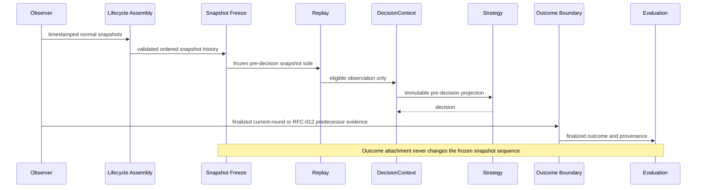

# Discovery Session 1 — Dataset Inventory

## Status

Read-only descriptive inventory. This session does not perform statistical
analysis, propose strategies, or create Research Questions.

## 1. Dataset identity and scope

The archived dataset is stored locally at:

- `data/research/snapshots/rfc012-validation-48hr/replay_dataset_v1.jsonl`
- `data/research/snapshots/rfc012-validation-48hr/replay_dataset_v1.metadata.json`

The archive README identifies it as the first exploratory dataset following
RFC-012 completion. The label **RFC-012 Validation — 48 Hour** describes the
approximate RFC-012 collection checkpoint at which it was archived. It does
not describe the temporal extent of the replay dataset. The managed replay
payload is a **cumulative rebuild from 20 raw observer files** spanning the
complete retained observation history available at that checkpoint. Its
referenced observations cover approximately 19 days.

### 1.1 Dataset overview

| Property | Value |
|---|---:|
| Dataset version | `replay-dataset-v1` |
| Metadata schema version | `2` |
| Created at | `2026-08-11T04:50:44.880680+00:00` |
| Dataset SHA-256 | `7680856bc6a01f9b69be0921d6e66b3f43d5241a38e63b37871b6925c1d59ba7` |
| Integrity status | `valid` |
| Replay rounds | 18,653 |
| Snapshots | 1,390,766 |
| Complete rounds | 17,912 |
| Incomplete rounds | 741 |
| Round range | 342,063–362,956 |
| First referenced observation | `2026-07-23T04:47:51.776566+00:00` |
| Last referenced observation | `2026-08-11T04:51:11.866288+00:00` |
| Referenced source files | 20 |
| Source schema versions | 1 and 2 |
| Collector session identifiers represented | 10 |
| Malformed source records reported | 1 |

The lifecycle coverage labels in the payload are:

| Coverage status | Rounds |
|---|---:|
| `complete` | 17,912 |
| `partial_start` | 732 |
| `partial_end` | 7 |
| `partial_both` | 2 |

Coverage describes whether the observer saw the beginning and end margins of a
round. It is not a claim that every Solana slot was observed.

### 1.2 Outcome availability

| Outcome state | Rounds |
|---|---:|
| Locally observed | 3,507 |
| Historically enriched | 0 |
| Missing | 15,146 |

The locally observed outcomes are further identified by capture mode:

| Capture mode | Rounds |
|---|---:|
| `current_round` | 1,327 |
| `post_transition_predecessor` | 2,180 |

The metadata's `ready_for_replay` value is `false` because 15,146 lifecycle
records have no finalized outcome under that metadata contract. The snapshot
and outcome sides remain distinct: a round may have valid replay snapshots but
no outcome for evaluation.

### 1.3 Observation frequency

The Observer command defaults to one snapshot attempt per second
([`collect.py`](../../../src/orev3/observer/collect.py#L224-L241)). The archived
references exhibit the same approximate cadence within round lifecycles:

| Descriptive inventory | Value |
|---|---:|
| Snapshots per round, arithmetic mean | 74.56 |
| Snapshots per round, median | 77 |
| Minimum snapshots in one lifecycle | 1 |
| Maximum snapshots in one lifecycle | 146 |
| Consecutive within-round intervals | 1,372,113 |
| Median within-round interval | 1.009873 seconds |
| Arithmetic mean within-round interval | 1.048642 seconds |
| Minimum within-round interval | 0.800033 seconds |
| Maximum within-round interval | 48.396671 seconds |
| Intervals no longer than 1.5 seconds | 1,369,256 |

These values describe collection cadence only. They are not an analysis of
relationships between observation frequency and outcomes.

## 2. Physical and logical organization

The managed replay payload has one compact `RoundLifecycleIndexRecord` per
line. A line contains:

1. lifecycle identity and boundaries;
2. ordered references to raw observer snapshots;
3. an optional finalized outcome and its provenance; and
4. lifecycle quality metadata.

It does not duplicate the full 1,390,766 snapshots. Each
`ObservationReference` names the raw source file and line and records its
timestamp and RPC slot. Replay reopens those immutable raw lines and normalizes
them ([`historical/models.py`](../../../src/orev3/historical/models.py#L247-L303),
[`replay/loader.py`](../../../src/orev3/replay/loader.py#L143-L174)).

## 3. Snapshot schema: information present before a decision

### 3.1 Normalized snapshot envelope

Each referenced raw observation normalizes to the following snapshot envelope.
These fields exist at the time the observation is recorded:

| Field | Shape | Description |
|---|---|---|
| `source_schema_version` | integer | Raw Observer schema version |
| `observed_at_utc` | timestamp | Wall-clock observation time |
| `rpc_slot` | integer | RPC context slot associated with the observation |
| `collector_session_id` | string or null | Observer process session identifier; absent in schema v1 |
| `board` | object | Board state read for this observation |
| `treasury` | object | Treasury state read for this observation |
| `round` | object | Board-selected Round account state |
| `source_file` | string | Immutable raw JSONL source path |
| `source_line_number` | integer | One-based raw source line number |

The normalization contract is defined in
[`historical/models.py`](../../../src/orev3/historical/models.py#L53-L75) and
[`historical/reader.py`](../../../src/orev3/historical/reader.py#L19-L63).

### 3.2 Board state

| Field | Shape | Decision-time meaning |
|---|---|---|
| `board.round_id` | integer | Round selected by the Board at observation time |
| `board.start_slot` | integer | Round start boundary reported by the Board |
| `board.end_slot` | integer | Round end boundary, or the protocol's initialization sentinel |
| `board.production_cost_ema` | integer or null | Board production-cost exponential moving average when supplied by the source schema |

### 3.3 Treasury state

| Field | Shape | Decision-time meaning |
|---|---|---|
| `treasury.motherlode` | integer | Treasury motherlode value observed at that moment |

### 3.4 Round state

Every square-valued vector contains exactly 25 integers.

| Field | Shape | Availability and meaning |
|---|---|---|
| `round.round_id` | integer | Round account identity |
| `round.deployed_lamports` | 25 integers | Lamports deployed to each square at observation time |
| `round.mass` | 25 integers | Decoded mass vector. It is structurally present, but the audited feature architecture prohibits using `mass` as a predictive feature because the canonical audited data contains only zero mass |
| `round.miner_counts` | 25 integers | Miner count for each square at observation time |
| `round.slot_hash_hex` | hexadecimal string | Decoded slot hash. A nonzero value is also an explicit finalization indicator and its finalized value is not decision-time input |
| `round.expires_at` | integer | Round-account expiry slot |
| `round.motherlode` | integer | Round motherlode value in the observed account state |
| `round.rewards` | 25 integers | Reward buckets in the observed account state; finalized reward values belong to the outcome boundary |
| `round.total_vaulted` | integer | Total vaulted value in the observed account state; a positive finalized value is an outcome indicator |
| `round.total_winnings` | integer | Total winnings in the observed account state; a positive finalized value is an outcome indicator |
| `round.total_miners` | integer | Total miner count reported at observation time |
| `round.top_miner` | string | Top-miner account value in the observed account state; the finalized value belongs to the outcome boundary |
| `round.entropy` | integer or null | Finalized entropy. Before finalization it is null; a non-null value is outcome-only and must never be used predictively |

The important distinction is temporal, not merely structural. Some fields are
present in the active Round account as placeholders and later contain finalized
facts. Only the values captured in the selected pre-decision observation are
eligible as contemporaneous state. Finalized values must not be moved backward
across the decision boundary.

### 3.5 Derived replay timing fields

The Replay Engine derives the following from the selected snapshot without
using a finalized outcome:

| Field | Derivation |
|---|---|
| `start_slot` | Selected snapshot's Board start slot |
| `end_slot` | Selected Board end slot, or null for the initialization sentinel |
| `slots_elapsed` | `max(rpc_slot - start_slot, 0)` |
| `slots_remaining` | `max(end_slot - rpc_slot, 0)`, or null during initialization |

The conversion explicitly excludes lifecycle-level finalized outcome metadata
([`replay/engine.py`](../../../src/orev3/replay/engine.py#L20-L88)).

### 3.6 Actual DecisionContext surface

The Strategy Lab does not expose the complete normalized snapshot. Its
DecisionContext contains:

- `round_id`;
- `observed_at_utc`;
- `rpc_slot`;
- `start_slot`;
- `end_slot`;
- `slots_elapsed`;
- `slots_remaining`;
- `board.round_id`;
- `board.start_slot`;
- `board.end_slot`;
- `board.production_cost_ema`;
- `treasury.motherlode`;
- `round.round_id`;
- `round.deployed_lamports`;
- `round.miner_counts`;
- `round.rewards`;
- `round.expires_at`;
- `round.motherlode`;
- `round.total_vaulted`;
- `round.total_winnings`;
- `round.total_miners`; and
- `round.top_miner`.

It does not expose `mass`, `slot_hash_hex`, `entropy`, collector-session
identity, source path, or source line. This projection is defined in
[`strategy_lab/runner.py`](../../../src/orev3/strategy_lab/runner.py#L147-L183).
Regardless of structural inclusion, no finalized value is permitted to become
DecisionContext input.

## 4. Outcome schema: information available only after outcome revelation

`FinalizedRoundOutcome` is separate from `observation_references`. It is used
only after a decision for labels, evaluation, or economics.

| Field | Shape | Description |
|---|---|---|
| `observed_at_utc` | timestamp | Time the finalized state was observed or fetched |
| `rpc_slot` | integer | RPC context slot of the finalized observation or enrichment read |
| `entropy` | integer or null | Finalized entropy when available |
| `winning_square` | integer or null | Winning square, derived as `entropy % 25` when entropy exists |
| `deployed_lamports` | 25 integers | Final aggregate deployment vector |
| `miner_counts` | 25 integers | Final miner-count vector |
| `reward_buckets` | 25 integers | Final reward vector |
| `total_vaulted` | integer | Final total vaulted value |
| `total_winnings` | integer | Final total winnings |
| `total_miners` | integer | Final total miners |
| `round_motherlode` | integer | Final Round motherlode |
| `top_miner` | string | Final top-miner account |

Finalization is accepted only when the snapshot has an explicit finalized-state
indicator: nonzero slot hash, non-null entropy, positive total vaulted, or
positive total winnings. The assembler uses the latest explicitly finalized
snapshot and constructs the outcome separately
([`historical/assembler.py`](../../../src/orev3/historical/assembler.py#L20-L91)).

### 4.1 Outcome provenance fields

The lifecycle record carries the following outcome-only metadata:

| Field | Values in this archive | Meaning |
|---|---|---|
| `finalized_outcome_source` | `observed`, null | Broad source. This archive contains no `enriched` outcomes |
| `finalized_outcome_capture_mode` | `current_round`, `post_transition_predecessor`, null | Local observation path |
| `finalized_outcome_evidence_identities` | ordered strings | Immutable RFC-012 evidence identities supporting an accepted observed outcome |

These fields describe the outcome's provenance. They are not replay snapshots
and do not enter DecisionContext.

## 5. Information timeline

| Stage | Newly available information | Permanently unavailable at this stage |
|---|---|---|
| Observer poll of active round | One timestamped Board, Treasury, and Round snapshot plus source/session provenance | Future observations; finalized outcome |
| Lifecycle assembly | Ordered normal snapshot history; lifecycle boundaries; source set; coverage and gap quality metadata | RFC-012 post-transition evidence has not yet been consumed |
| RFC-012 freeze boundary | Immutable identity of the ordered decision-snapshot side | Outcomes cannot change snapshot content or order |
| Replay selection | Latest eligible observation at or before the requested decision slot; derived elapsed/remaining slots | Later observations and finalized outcome |
| DecisionContext construction | The explicit Strategy Lab projection listed in Section 3.6 | Entropy, winning square, outcome provenance, RFC-012 evidence, later snapshots |
| Strategy decision | Strategy output based only on frozen DecisionContext | Outcome remains unrevealed |
| Board transition / finalization | Current-round final state or one RFC-012 post-transition predecessor observation may become available | It cannot be inserted into the earlier snapshot sequence |
| Outcome reconciliation | Finalized outcome and canonical provenance attach to the lifecycle's outcome position | Decision snapshots remain frozen |
| Historical enrichment, if used | Missing outcome may be fetched and labeled `enriched` | It cannot be relabeled as locally observed or inserted into replay history |
| Evaluation | Outcome is revealed after the decision | It does not retroactively modify DecisionContext |
| RFC-011 economics | Final facts and provenance can be consumed with deployment and evaluation outputs | Economic results do not modify historical snapshots |

## 6. Candidate predictive feature inputs

This section identifies contemporaneous information that exists; it does not
recommend a model or strategy.

### 6.1 Direct contemporaneous inputs

- decision timing: `rpc_slot`, `slots_elapsed`, and `slots_remaining`;
- round boundaries: `start_slot` and `end_slot`;
- Board environment: `production_cost_ema`;
- Treasury environment: `treasury.motherlode`;
- per-square deployment: the 25 `deployed_lamports` values;
- per-square participation: the 25 `miner_counts` values;
- active-state reward and aggregate fields only as they existed in the selected
  pre-decision observation; and
- current `total_miners`.

### 6.2 Contemporaneous derived candidates

Derivations that can be formed without future information include:

- each square's share of current deployed lamports;
- each square's share of current miners;
- within-observation ranks, tie-aware comparisons, and leader ratios;
- contemporaneous board totals and concentration summaries;
- differences from earlier observations of the same round;
- elapsed-time-normalized changes using only earlier timestamps or slots; and
- initialization or missing-timing indicators based on fields already absent at
  the selected observation.

These are candidate feature *forms*, not findings about usefulness. They must
be computed only from the selected observation and its earlier history.

### 6.3 Explicit exclusions

The following are labels, evaluation facts, audit metadata, or otherwise
ineligible as predictive inputs:

- `winning_square`;
- finalized `entropy`;
- finalized reward buckets and settlement totals;
- `finalized_outcome_source`;
- `finalized_outcome_capture_mode`;
- `finalized_outcome_evidence_identities`;
- future observations;
- final Board or Round state unavailable at decision time;
- outcome-enriched values;
- source path and line number as accidental dataset-location signals; and
- `mass`, under the repository's audited feature rule that the available mass
  signal is constant zero and not a valid predictive feature.

## 7. Fields that are static or identity-like

The following classification is based on schema role and lifecycle semantics,
not on a statistical variability study.

### 7.1 Dataset-static

- dataset version;
- metadata schema version;
- creation timestamp;
- dataset SHA-256;
- source-collection list;
- integrity status; and
- dataset-level counts recorded in metadata.

### 7.2 Lifecycle-static after assembly

- lifecycle schema version;
- lifecycle `round_id`;
- canonical `start_slot` and `end_slot`;
- first/last observation timestamps and RPC slots;
- observation count;
- collector-session set;
- source-schema-version set;
- source-file set;
- ordered observation references;
- coverage and quality summary; and
- finalized outcome/provenance once the managed lifecycle record is written.

### 7.3 Normally stable within one active round

- Board and Round `round_id`;
- initialized Board start and end slots;
- Round `expires_at`;
- source schema version within one source format; and
- collector session identifier until the observer process changes.

Initialization can cause provisional Board boundaries to change before the
round becomes active, and a round can span source files or collector sessions.
Those fields are therefore not globally constant.

### 7.4 Outcome-transition fields

These are generally placeholders during active observation and change at the
finalization boundary rather than evolving as ordinary predictive state:

- `slot_hash_hex`;
- `entropy`;
- final `rewards` / `reward_buckets`;
- final `total_vaulted`;
- final `total_winnings`;
- final `top_miner`; and
- finalized outcome provenance.

## 8. Fields that evolve at observation cadence

The following can change between consecutive active-round polls and therefore
represent the rapidly updating portion of the snapshot:

- `observed_at_utc`;
- `rpc_slot`;
- `source_line_number`;
- derived `slots_elapsed` and `slots_remaining`;
- per-square `deployed_lamports`;
- per-square `miner_counts`;
- `total_miners`; and
- any active aggregate or Board/Treasury value whose on-chain account changes
  between reads.

`source_file` changes at file boundaries, and `collector_session_id` changes at
process boundaries. They evolve operationally, not as ORE decision state.

This section identifies which fields *can* update at the poll cadence. It does
not measure their empirical rates of change or relate those changes to outcomes.

## 9. Inventory conclusion

The archive contains a cumulative, integrity-valid dataset of 18,653 replay
rounds and 1,390,766 observations, each represented by one referenced snapshot.
Its normal observation side contains timestamped Board, Treasury, and Round
state at approximately one-second cadence. Its outcome side is separate and
contains 3,507 locally
observed finalized outcomes, including 2,180 captured through RFC-012's
post-transition predecessor path; 15,146 outcomes are absent.

The information boundary is explicit:

- ordinary snapshots and their earlier history can supply decision-time state;
- finalized outcomes and provenance attach only after the snapshot side is
  frozen; and
- Replay, DecisionContext, and Strategy never receive RFC-012 evidence or
  finalized outcome fields before the decision.

No claim is made here about predictive value, relationships between fields, or
strategy performance.
