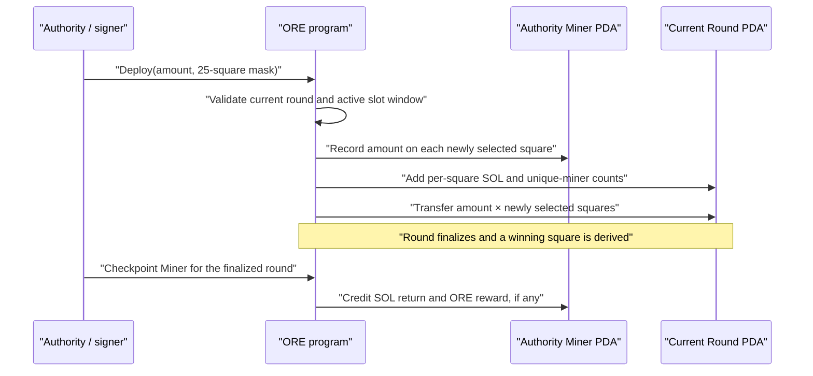

# ORE Mining Resource Semantics

Status: Research investigation
Date: 2026-07-30
Scope: Protocol, official client, and repository behavior; no implementation proposal

## Executive conclusion

ORE v3 mining is not proof-of-work performed by a participant-controlled fleet
of computational miners. During an active round, an on-chain authority deploys a
specified amount of SOL to one or more of 25 board squares. The program records
one 25-element SOL-deployment vector in the authority's `Miner` account and
aggregates those deployments in the round account.

For one authority in one round:

- one `Deploy` instruction can select any subset of the 25 squares;
- multiple `Deploy` instructions are permitted;
- after a positive amount has been recorded for a square, later deploy calls by
  that authority skip that square;
- therefore, the meaningful protocol capacity is at most 25 distinct positive
  square allocations per authority per round, not one placement and not one
  transaction;
- the amount argument applies independently to every newly selected square, so
  the capital transferred is `amount × newly deployed squares`.

The protocol does not identify a natural person. It identifies an authority
public key and derives one `Miner` account from that authority. A single person
may control more than one authority, and the program does not link those
authorities to a common human owner.

The primary participant-controlled resource is therefore **SOL-denominated
capital exposure allocated across square slots during the round's finite
transaction-inclusion window**. The 25 square slots per authority are a hard
protocol capacity. Transaction fees, compute and size limits, account-lock
contention, confirmation latency, and the round deadline are operational
constraints. Wallets or authority keys are identities and control boundaries,
not units of deployed work. “Number of miners” remains meaningful as the
protocol's count of distinct authority-backed Miner accounts, but it is not a
faithful abstraction for the resource controlled by one participant.

## Evidence and version boundary

This investigation uses three evidence layers:

1. **Protocol facts** come from the official
   [`regolith-labs/ore`](https://github.com/regolith-labs/ore) on-chain program
   and API at commit
   [`3112ab78a64f92892a70d5d4cbd17e1d14b1c2fe`](https://github.com/regolith-labs/ore/tree/3112ab78a64f92892a70d5d4cbd17e1d14b1c2fe),
   inspected on 2026-07-30.
2. **Official client behavior** comes from the CLI in that same pinned
   revision.
3. **Repository behavior** comes from this repository's observer, RFC-008 paper
   configuration, and RFC-010 deployment abstractions.

The pinned revision matters: protocol source can change. Conclusions below
describe that inspected ORE v3 implementation and the behavior presently
decoded or modeled by this repository.

## Protocol facts

### The round action

The protocol's `Deploy` instruction contains an unsigned 64-bit `amount` and a
32-bit square mask ([instruction definition, lines
64–69](https://github.com/regolith-labs/ore/blob/3112ab78a64f92892a70d5d4cbd17e1d14b1c2fe/api/src/instruction.rs#L64-L69)).
The official SDK accepts a 25-element Boolean square selection, turns it into
the mask, derives the round and authority-specific Miner accounts, and marks
the signer as required ([SDK, lines
110–156](https://github.com/regolith-labs/ore/blob/3112ab78a64f92892a70d5d4cbd17e1d14b1c2fe/api/src/sdk.rs#L110-L156)).

The on-chain handler describes the instruction as deploying capital to
prospect on a square. It accepts the instruction only while the Board is in its
active slot interval and only for the Board's current round
([deploy handler, lines
14–56](https://github.com/regolith-labs/ore/blob/3112ab78a64f92892a70d5d4cbd17e1d14b1c2fe/program/src/deploy.rs#L14-L56)).
The configured round length in this program revision is 150 slots
([constants, lines
25–44](https://github.com/regolith-labs/ore/blob/3112ab78a64f92892a70d5d4cbd17e1d14b1c2fe/api/src/consts.rs#L25-L44)).
The comment labels 150 slots as one minute; the enforceable fact is the
150-slot window rather than a guaranteed wall-clock duration.

The participant's round lifecycle is:

The checkpoint is part of the participant lifecycle, but it is not another
placement. It computes the authority's finalized return from the already
recorded deployment. If the authority deployed to the winning square, its SOL
return includes the winning-square principal less the program fee and its
proportional share of the round's winnings pool; ORE split and motherlode
rewards are likewise proportional where applicable
([checkpoint, lines
73–139](https://github.com/regolith-labs/ore/blob/3112ab78a64f92892a70d5d4cbd17e1d14b1c2fe/program/src/checkpoint.rs#L73-L139)).
If the round has no usable randomness, the handler refunds the recorded
deployments ([checkpoint, lines
141–153](https://github.com/regolith-labs/ore/blob/3112ab78a64f92892a70d5d4cbd17e1d14b1c2fe/program/src/checkpoint.rs#L141-L153)).

### Multiple placements in one round

Yes, at the protocol-authority level.

The `Miner` account stores a 25-element `deployed` array described as “the
amount of SOL deployed on each square”
([Miner state, lines
8–33](https://github.com/regolith-labs/ore/blob/3112ab78a64f92892a70d5d4cbd17e1d14b1c2fe/api/src/state/miner.rs#L8-L33)).
The account is derived from the authority public key
([Miner state, lines
68–71](https://github.com/regolith-labs/ore/blob/3112ab78a64f92892a70d5d4cbd17e1d14b1c2fe/api/src/state/miner.rs#L68-L71)).

For every selected square, the deploy handler:

1. skips the square if the authority's Miner account already has a positive
   deployment there;
2. otherwise stores `amount` in that square;
3. adds `amount` to the round's per-square total;
4. increments the round's per-square unique-miner count; and
5. adds `amount` to the SOL transferred for the instruction.

Those operations are explicit in the square loop
([deploy handler, lines
277–312](https://github.com/regolith-labs/ore/blob/3112ab78a64f92892a70d5d4cbd17e1d14b1c2fe/program/src/deploy.rs#L277-L312)).
The transfer is the accumulated total for all newly deployed squares
([deploy handler, lines
328–350](https://github.com/regolith-labs/ore/blob/3112ab78a64f92892a70d5d4cbd17e1d14b1c2fe/program/src/deploy.rs#L328-L350)).

Consequences:

| Action by one authority in one round | Protocol result |
|---|---|
| Select squares 2, 8, and 19 with amount `A` in one instruction | Three positive square allocations; `3A` SOL transferred |
| Later select squares 4 and 11 with amount `B` | Two additional allocations; `2B` SOL transferred |
| Later select square 8 again with amount `C` | Square 8 is skipped; its recorded amount is not topped up or replaced |
| Select all 25 unused squares in one instruction | 25 allocations; `25A` SOL transferred |
| Submit further calls after all 25 have positive deployments | No additional positive square allocation is available for that authority |

Thus “placement” must be defined carefully:

- a **transaction** is not a placement;
- a **Deploy instruction** may create zero, one, or many new square
  allocations;
- a **positive square allocation** is the durable authority–round–square
  deployment;
- one authority has at most 25 such positive allocations in one round.

The handler does not impose a separate numeric cap on the number of deploy
instructions or transactions an authority may attempt during the window.
Attempts cease to add meaningful deployment once the authority's 25 positive
square entries are occupied.

### Protocol identity and “miner”

The Round account defines:

- `count[25]` as the number of unique miners on each square; and
- `total_miners` as the total number of unique miners that played in the round

([Round state, lines
9–55](https://github.com/regolith-labs/ore/blob/3112ab78a64f92892a70d5d4cbd17e1d14b1c2fe/api/src/state/round.rs#L9-L55)).
The deploy handler increments `total_miners` only on an authority's first
positive deployment in the round
([deploy handler, lines
262–316](https://github.com/regolith-labs/ore/blob/3112ab78a64f92892a70d5d4cbd17e1d14b1c2fe/program/src/deploy.rs#L262-L316)).

Accordingly, “miner” in these counters means a distinct authority-backed Miner
account, not:

- a physical mining machine;
- a CPU or GPU worker;
- one transaction;
- one square allocation; or
- a verified natural person.

The direct SDK supports distinct signer and authority arguments, and the
program supports an automation executor acting for an authority under the
automation account's checks
([SDK, lines
110–149](https://github.com/regolith-labs/ore/blob/3112ab78a64f92892a70d5d4cbd17e1d14b1c2fe/api/src/sdk.rs#L110-L149);
[automation checks, lines
77–89](https://github.com/regolith-labs/ore/blob/3112ab78a64f92892a70d5d4cbd17e1d14b1c2fe/program/src/deploy.rs#L77-L89)).
This further separates the durable mining identity (authority) from the
transaction submitter (signer or authorized executor).

## Limits on participant action

### Hard protocol limits

| Limit | Evidence | Meaning |
|---|---|---|
| 25 board squares | The SDK and state use 25-element arrays; the instruction encodes the selection in a 32-bit mask | The square domain is fixed at 0–24 |
| One positive stored amount per authority–round–square | A square is skipped when `miner.deployed[square] > 0` | The same authority cannot top up or replace a positive allocation on that square during that round |
| Current round only | The round PDA and ID must match the Board's current round | A deployment cannot be directed to an arbitrary historical or future round |
| Active slot window | Board validation requires `start_slot <= slot < end_slot` | Valid inclusion must occur before the round closes |
| Prior-round checkpoint | A Miner entering a new round must have checkpointed its prior round | Unsettled Miner state blocks the authority from resetting its allocation vector for a later round |
| Authority-specific Miner PDA | Miner PDA derives from authority | Each authority receives its own 25-slot deployment vector |

The prior-round checkpoint condition is enforced before the Miner allocation
array is reset for a new round
([deploy handler, lines
248–260](https://github.com/regolith-labs/ore/blob/3112ab78a64f92892a70d5d4cbd17e1d14b1c2fe/program/src/deploy.rs#L248-L260)).

There is no on-chain natural-person identity and therefore no protocol-level
rule that aggregates several authorities controlled by the same person into
one participant limit.

### Economic limits

The protocol transfers the specified lamports once for every newly deployed
square, so the immediate capital requirement is:

`per-square amount × number of newly deployed squares`

That SOL becomes round exposure. If the authority does not occupy the winning
square, its deployment does not enter that authority's winning return. If a
winning square has participants, non-winning deployments fund the winnings
pool after protocol deductions; if the winning square is empty, deployed SOL
is routed according to the empty-winner settlement path
([reset settlement, lines
132–186](https://github.com/regolith-labs/ore/blob/3112ab78a64f92892a70d5d4cbd17e1d14b1c2fe/program/src/reset.rs#L132-L186)).

The program also reserves 10,000 lamports for checkpointing when the Miner has
no checkpoint reserve
([constants, lines
94–95](https://github.com/regolith-labs/ore/blob/3112ab78a64f92892a70d5d4cbd17e1d14b1c2fe/api/src/consts.rs#L94-L95);
[deploy handler, lines
322–325](https://github.com/regolith-labs/ore/blob/3112ab78a64f92892a70d5d4cbd17e1d14b1c2fe/program/src/deploy.rs#L322-L325)).
Automation can add its configured fee and requires enough automation balance
for all requested squares plus that fee
([deploy handler, lines
265–273](https://github.com/regolith-labs/ore/blob/3112ab78a64f92892a70d5d4cbd17e1d14b1c2fe/program/src/deploy.rs#L265-L273)).

These are distinct from Solana transaction fees paid for inclusion.

### Wallet and authority limits

One authority has one Miner PDA and one 25-square deployment vector. It must
have access to sufficient SOL for:

- the square deployments;
- transaction fees;
- any required account creation or rent funding;
- the checkpoint reserve; and
- any configured automation fee.

The protocol does not enforce “one wallet per person,” nor does it treat a
wallet count as a capital amount. A person controlling multiple authority keys
can control multiple Miner PDAs. That is a protocol fact about the absence of a
cross-authority human identity, not evidence about how many authorities any
particular participant actually uses.

### Transaction and network limits

One Deploy instruction can encode all 25 square choices, so a square allocation
does not intrinsically require a separate transaction. The official CLI's
single-square command constructs one selected-square mask and submits one
instruction in one transaction
([official CLI, lines
539–558](https://github.com/regolith-labs/ore/blob/3112ab78a64f92892a70d5d4cbd17e1d14b1c2fe/cli/src/main.rs#L539-L558)).
The protocol SDK itself supports every 25-element selection, independent of
that command's one-square user interface.

Solana adds operational limits:

- transactions are atomic collections of instructions and have a maximum
  serialized size of 1,232 bytes;
- the maximum compute-unit limit is 1.4 million per transaction;
- every transaction pays a base fee in SOL and may pay a prioritization fee;
- prioritization and scheduling account for requested compute, signatures, and
  writable-account locks.

These facts are specified in the official
[Solana transaction documentation](https://solana.com/docs/core/transactions),
[compute documentation](https://solana.com/docs/core/fees#compute-unit-limit),
and [fee documentation](https://solana.com/docs/core/fees). The inspected ORE
CLI explicitly requests a 1.4-million compute-unit limit and a compute-unit
price before signing and submitting
([official CLI, lines
1099–1125](https://github.com/regolith-labs/ore/blob/3112ab78a64f92892a70d5d4cbd17e1d14b1c2fe/cli/src/main.rs#L1099-L1125)).

The deploy instruction writes shared Board and Round accounts as well as the
authority-specific Miner account. Consequently, network inclusion, shared
account scheduling, RPC/validator latency, and the active slot deadline can
constrain how many attempted changes land in time. These are operational
throughput constraints, not an additional ORE rule assigning a fixed
transaction quota to each participant.

## Resource hierarchy

The resources are not interchangeable:

| Resource | Scarcity type | Participant control | Protocol meaning |
|---|---|---|---|
| SOL deployment capital | Economic, primary | Amount and square distribution | Determines the authority's capital exposure and proportional share where the settlement path is proportional |
| Unused authority–round–square entries | Hard protocol capacity | Choice of up to 25 distinct squares per authority | A positive entry cannot be topped up or replaced in the round |
| Round inclusion time | Hard temporal window | Submission timing only | Transaction must land while the round is active |
| Transaction fees and priority budget | Economic/operational | Fee payer and requested priority | Pays for Solana execution and affects inclusion incentives |
| Transaction size and compute | Network protocol | Instruction packing and compute request | Bounds what fits and executes in one Solana transaction |
| Authority keys / Miner PDAs | Identity and control boundary | Which authorities the participant controls | Separates on-chain Miner state; not proof of distinct humans |
| RPC and validator access | Operational | Endpoint and submission path | Affects observation, submission, and confirmation, not payoff weight directly |
| Compute hardware | Operational client resource | Client execution | Not the ORE v3 consensus/mining commodity represented in Round state |

The scarce payoff-bearing resource is SOL exposure. The hard placement capacity
is the authority's remaining unused squares. Time and transaction inclusion are
scarce for getting that exposure recorded. “Transactions,” “wallets,” and
“miners” describe mechanisms or identities; none alone captures the deployed
resource.

## Repository behavior

### Observer

This repository points at the same ORE v3 program ID and derives Round PDAs from
the program's `round` seed
([observer account decoder](../../src/orev3/observer/accounts.py)).
It decodes 25-element arrays for:

- deployed lamports;
- mass;
- miner counts; and
- rewards,

as well as `total_miners`. The round inspector displays deployed SOL and miner
counts separately for each square, and displays total deployed SOL separately
from total unique miners
([round inspector](../../src/orev3/observer/inspect_round.py)).
That separation is consistent with the on-chain distinction between capital
and authority count.

The repository observer is an account-state reader. It does not implement a
live ORE placement client, does not identify natural persons behind authorities,
and does not establish a participant's wallet inventory.

### RFC-008 paper collection

RFC-008 is explicitly paper-only. Its configuration reconstructs four-square,
50,000-lamport paper decisions and disables wallet access, signing, transaction
building, transaction submission, and claims
([RFC-008 paper configuration](../../config/collection/rfc008_paper_v1.json)).
Its accounting mode is
`historical_price_taking_reconstructed_not_wallet_realized`.

Therefore, RFC-008's four-square paper action is an experimental configuration,
not an on-chain rule that limits ORE participants to four placements, 50,000
lamports, or one transaction.

### RFC-010 Strategy Lab

The Strategy Lab's current `DeploymentAllocation` contains abstract
`allocation_amount` and `allocation_weight` fields. The Equal Weight model
splits a unit allocation among all ranked candidates, while the Top Ranked
model assigns a unit allocation to one candidate
([deployment abstractions](../../src/orev3/strategy_lab/deployment.py)).
Those values are deterministic research conviction abstractions. The existing
Strategy Lab does not bind them to:

- lamports;
- an authority or Miner PDA;
- the authority's already occupied square entries;
- a Solana transaction;
- transaction fees or priority;
- a round inclusion deadline; or
- multiple participant-controlled authorities.

This is a boundary observation, not an implementation recommendation.

## Architectural observations

### Is “number of miners” meaningful for one participant?

It is meaningful only in its defined on-chain sense:

- per square, it is a count of distinct Miner authorities that deployed there;
- per round, it is a count of distinct Miner authorities with a positive
  deployment.

It can therefore describe observed competition or authority participation.
It does **not** express how much deployable resource one participant controls.
One authority can allocate to as many as 25 squares, and one natural person can
control multiple authorities without the program linking them.

### Resource abstraction exposed by the protocol

At a single-authority level, the protocol exposes the participant's controllable
round position as:

`(authority, round, deployed_lamports[25])`

subject to:

- total available SOL and fee funding;
- at most one positive recorded amount per square;
- prior-round checkpoint eligibility;
- transaction execution and inclusion constraints; and
- the finite active-round window.

If a participant controls multiple authorities, the protocol exposes one such
vector per authority. The source does not provide a canonical on-chain method
to collapse them into a human-level “participant.”

This makes “number of miners” a poor synonym for participant capacity.
The semantically faithful resource dimensions visible in the protocol are:

1. SOL budget and per-square SOL exposure;
2. unused square slots for each authority;
3. authority count only when multiple controlled authorities are explicitly
   part of the factual operating context; and
4. transaction-fee, compute, size, timing, and inclusion capacity.

No claim is made here about which of those dimensions a future model should
implement.

## Direct answers

1. **What action does a miner perform each round?**
   An authority submits a Deploy instruction during the active round, selecting
   one or more board squares and specifying a per-square amount of SOL. After
   finalization, its Miner state is checkpointed to credit finalized returns
   and rewards.

2. **Can one participant submit multiple placements in the same round?**
   Yes, when “participant” means one protocol authority. Multiple Deploy calls
   can add previously unused squares, and one call can add multiple squares.
   A previously positive square cannot be topped up or replaced by that
   authority during the round.

3. **What limits exist?**
   The hard ORE limits are 25 squares per authority, one positive amount per
   authority–round–square, current-round and active-slot validation, and
   prior-round checkpointing. Economic limits are deployable SOL, settlement
   exposure, checkpoint/automation costs, and Solana fees. Wallets define
   authorities but are not globally limited per human. Transaction execution
   is bounded by Solana size, compute, fees, account scheduling, network
   inclusion, and the round deadline.

4. **What resource is actually scarce?**
   The primary payoff-bearing scarce resource is SOL capital allocated to
   squares. Unused square entries and inclusion time are hard capacity
   constraints. Transaction budget and network access are operational
   constraints.

5. **Is “number of miners” the right abstraction for one participant?**
   No, not as a participant resource. It is an authority-count statistic.
   Protocol-level participant control is expressed by SOL allocation vectors
   over the remaining square slots of one or more authorities, under fee and
   inclusion constraints.

## References

### Official ORE sources

- [ORE repository and README, pinned revision](https://github.com/regolith-labs/ore/tree/3112ab78a64f92892a70d5d4cbd17e1d14b1c2fe)
- [Deploy instruction](https://github.com/regolith-labs/ore/blob/3112ab78a64f92892a70d5d4cbd17e1d14b1c2fe/api/src/instruction.rs#L64-L69)
- [Deploy SDK](https://github.com/regolith-labs/ore/blob/3112ab78a64f92892a70d5d4cbd17e1d14b1c2fe/api/src/sdk.rs#L110-L156)
- [Miner state](https://github.com/regolith-labs/ore/blob/3112ab78a64f92892a70d5d4cbd17e1d14b1c2fe/api/src/state/miner.rs#L8-L71)
- [Round state](https://github.com/regolith-labs/ore/blob/3112ab78a64f92892a70d5d4cbd17e1d14b1c2fe/api/src/state/round.rs#L9-L107)
- [Deploy handler](https://github.com/regolith-labs/ore/blob/3112ab78a64f92892a70d5d4cbd17e1d14b1c2fe/program/src/deploy.rs#L14-L390)
- [Checkpoint settlement](https://github.com/regolith-labs/ore/blob/3112ab78a64f92892a70d5d4cbd17e1d14b1c2fe/program/src/checkpoint.rs#L60-L163)
- [Round reset and settlement](https://github.com/regolith-labs/ore/blob/3112ab78a64f92892a70d5d4cbd17e1d14b1c2fe/program/src/reset.rs#L132-L219)
- [Official CLI deploy command](https://github.com/regolith-labs/ore/blob/3112ab78a64f92892a70d5d4cbd17e1d14b1c2fe/cli/src/main.rs#L539-L558)
- [Official CLI transaction submission](https://github.com/regolith-labs/ore/blob/3112ab78a64f92892a70d5d4cbd17e1d14b1c2fe/cli/src/main.rs#L1099-L1125)

### Official Solana documentation

- [Transactions](https://solana.com/docs/core/transactions)
- [Transaction fees](https://solana.com/docs/core/fees)
- [Compute-unit limits and priority fees](https://solana.com/docs/core/fees#compute-unit-limit)

### Repository sources

- [ORE account decoder](../../src/orev3/observer/accounts.py)
- [Round inspector](../../src/orev3/observer/inspect_round.py)
- [RFC-008 paper configuration](../../config/collection/rfc008_paper_v1.json)
- [Strategy Lab deployment abstractions](../../src/orev3/strategy_lab/deployment.py)
- [Deployment semantics investigation](deployment-semantics-investigation.md)
