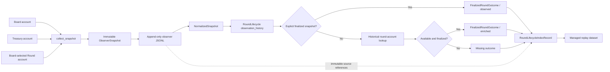
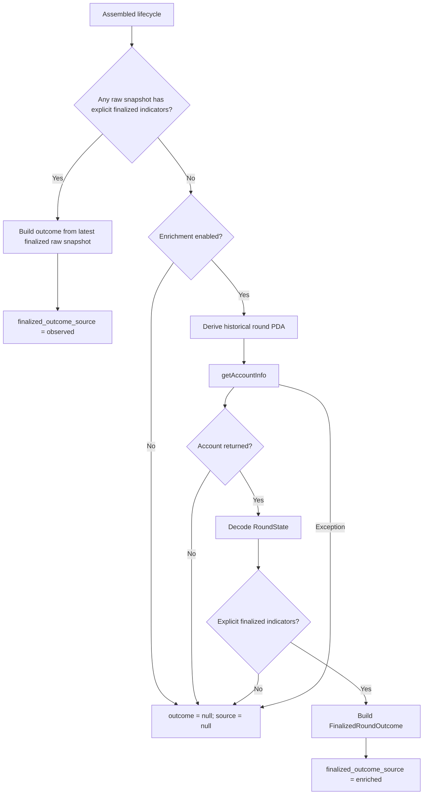

# Finalized Outcome Provenance Investigation

**Date:** 2026-07-30  
**Status:** Investigation complete  
**Scope:** Research Domain, read-only provenance analysis

## 1. Executive summary

The finalized-outcome pipeline preserves finalized information when the
observer actually samples it. The lifecycle reader and assembler do not
discard a persisted finalized outcome.

The published managed dataset contains 6,313 lifecycles:

- 610 are `observed`;
- 1,073 are `enriched`;
- 4,630 are missing an outcome.

An exhaustive resolution of every raw observation reference in the managed
dataset found:

- the 610 observed lifecycles contain 626 explicit finalized raw snapshots;
- the 1,073 enriched lifecycles contain zero finalized raw snapshots;
- the 4,630 missing lifecycles contain zero finalized raw snapshots;
- there are zero lifecycle/source classification mismatches.

The root cause is at the observer sampling boundary. Each observer iteration
reads the Board, derives only the Board's current `round_id`, and fetches only
that round account. Once a later Board read reports the next round, the
previous round is no longer selected. If no poll persisted explicit finalized
state before that handoff, the finalized outcome never entered local observer
history.

Enrichment is therefore not recovering information discarded by lifecycle
assembly. It is fetching finalized state that never existed locally in
finalized form. It succeeded for 1,073 accounts that were still externally
available. The remaining 4,630 had neither a local finalized snapshot nor an
available round account when investigated.

The earliest architectural location capable of preserving the complete
outcome is the Observer boundary after `decode_round` has produced a finalized
`RoundState` and before the observer stops selecting that round. The existing
repository persistence point is `JsonlSnapshotWriter.write`.

## 2. Evidence scope

This investigation is anchored to:

- managed dataset version: `replay-dataset-v1`;
- managed dataset SHA-256:
  `f3e6ed8a9745a871be25eea34151fb1104d239f4dd910f923ef397b2416f592a`;
- 491,401 persisted observation references;
- 6,313 lifecycle index records.

Raw references were resolved back to their exact source file and line. The
same finalization predicate used by lifecycle assembly was applied to every
resolved snapshot. No production state, replay semantics, or Strategy Lab
behavior was changed.

The earlier Dataset Management investigation independently probed all 4,630
missing outcomes. Every round account was unavailable. No timeout, HTTP 429,
network, decode, or not-finalized result occurred in that complete probe.

## 3. End-to-end sequence

```mermaid
sequenceDiagram
    participant Loop as "Observer loop"
    participant RPC as "Solana RPC"
    participant Decode as "Account decoders"
    participant Raw as "Observer JSONL"
    participant Assemble as "Lifecycle assembler"
    participant Enrich as "Outcome enricher"
    participant Dataset as "Managed dataset"

    Loop->>RPC: getSlot()
    Loop->>RPC: getMultipleAccounts(Board, Treasury)
    RPC-->>Loop: Board.current round_id and Treasury
    Loop->>Loop: derive address for Board.round_id
    Loop->>RPC: getAccountInfo(current round)
    RPC-->>Decode: encoded round account
    Decode-->>Loop: RoundState
    Loop->>Raw: append complete ObserverSnapshot
    Raw->>Assemble: normalize and group by round_id

    alt A raw snapshot contains explicit finalized indicators
        Assemble->>Assemble: derive FinalizedRoundOutcome
        Assemble->>Dataset: source = observed
    else No raw finalized snapshot
        Assemble->>Enrich: lifecycle outcome is absent
        Enrich->>RPC: getAccountInfo(historical round PDA)
        alt Account exists and is finalized
            RPC-->>Enrich: finalized RoundState
            Enrich->>Dataset: source = enriched
        else Account unavailable, not finalized, or lookup failed
            Enrich->>Dataset: outcome = null, source = null
        end
    end
```

## 4. Data-flow map



## 5. Observer

### 5.1 What the observer reads

`collect_snapshot` performs three temporally separate RPC reads:

1. `getSlot`;
2. one `getMultipleAccounts` request for Board and Treasury;
3. one `getAccountInfo` request for the round PDA derived from
   `board.round_id`.

The sequence is implemented in
[`observer/collect.py` lines 37–112](../../src/orev3/observer/collect.py#L37-L112).
The calls are not one atomic multi-account snapshot. The implementation does
not request or verify that Board and Round were read from the same RPC context.

The observer never chooses a historical round independently. It derives the
round address only from the Board value returned in the current iteration
([`observer/collect.py` lines 84–102](../../src/orev3/observer/collect.py#L84-L102)).

### 5.2 When finalization is first detectable

The observer itself has no `finalized` status branch. Its console status is
only `initializing` or `active`, based on whether Board `end_slot` contains the
uninitialized sentinel
([`observer/collect.py` lines 248–280](../../src/orev3/observer/collect.py#L248-L280)).

The first point at which the process possesses finalized information is when
`decode_round` returns a `RoundState` whose finalized fields have changed.
`decode_round` reads:

- the 32-byte slot hash;
- round motherlode;
- 25 reward values;
- total vaulted;
- total winnings;
- total miners;
- top miner.

It derives `entropy` by XORing four 64-bit parts of a nonzero, non-`0xff`
slot hash
([`observer/accounts.py` lines 177–298](../../src/orev3/observer/accounts.py#L177-L298)).

Finalization is not labeled at collection time. Lifecycle assembly later
classifies a snapshot as finalized if any of these explicit indicators is
present:

- nonzero slot hash;
- non-null entropy;
- positive total vaulted;
- positive total winnings.

That predicate is defined in
[`historical/assembler.py` lines 20–46](../../src/orev3/historical/assembler.py#L20-L46).
The enricher uses the same rule in
[`historical/enricher.py` lines 91–116](../../src/orev3/historical/enricher.py#L91-L116).

### 5.3 What is written

`ObserverSnapshot` contains:

- schema and collector session identity;
- observation timestamp and RPC slot;
- complete decoded Board state;
- complete decoded Treasury state;
- complete decoded Round state.

The immutable schema is in
[`data/models.py` lines 15–82](../../src/orev3/data/models.py#L15-L82).

Every successful `collect_snapshot` result is passed directly to
`JsonlSnapshotWriter.write` in the same collector iteration
([`observer/collect.py` lines 204–216](../../src/orev3/observer/collect.py#L204-L216)).
The writer serializes the complete model and appends one JSON line with
`O_APPEND` and one `os.write`
([`data/writer.py` lines 12–55](../../src/orev3/data/writer.py#L12-L55),
[`data/writer.py` lines 58–111](../../src/orev3/data/writer.py#L58-L111)).

Thus, when finalized fields are present in the decoded snapshot, they are
persisted immediately by the normal snapshot path. There is no separate
finalized-outcome file and no explicit finalized-outcome event.

The event writer records round transitions, but transition events contain only
the previous round ID, next round ID, session, timestamp, and RPC slot. They
contain no outcome state
([`observer/collect.py` lines 222–242](../../src/orev3/observer/collect.py#L222-L242)).

The JSONL writer closes the file descriptor after `os.write`; it does not call
`fsync`. Therefore `JsonlSnapshotWriter.write` is the earliest repository
persistence point, while the implementation does not assert a separate
fsync-level crash-durability guarantee.

### 5.4 The observer handoff boundary

Once a Board read returns round `N+1`, `collect_snapshot` derives and reads only
round `N+1`. It does not revisit round `N`.

This is the earliest point where an uncaptured finalized outcome becomes
locally unavailable: if round `N` never produced a persisted finalized
snapshot before that Board-selected handoff, no later local stage has round
`N`'s entropy or finalized totals.

The separate Board and Round RPC calls permit a narrow timing window in which
the Board read still identifies round `N` but the later round-account read
already contains finalized state. The implementation permits this observation
ordering; it does not guarantee it. The 610 observed outcomes are the cases in
which explicit finalized state was in fact persisted.

## 6. Stored observer data

### 6.1 Field inventory

| Question | Persisted in a finalized raw snapshot? | Provenance |
|---|---|---|
| Winning square | Not as a named field | Derived later as `entropy % 25` |
| Winning miner | No explicitly defined field | `top_miner` is persisted, but the implementation does not define it as a winning-miner identity |
| Round motherlode | Yes | `round.motherlode` |
| Treasury motherlode | Yes | `treasury.motherlode`; it is distinct from the round field |
| Explicit finalized-state flag | No | Finalization is inferred later from explicit state indicators |
| Slot hash | Yes | `round.slot_hash_hex` |
| Entropy | Yes when decodable from the slot hash | `round.entropy` |
| Deployed lamports | Yes | 25-value array |
| Miner counts | Yes | 25-value array |
| Rewards | Yes | 25-value raw protocol array |
| Total vaulted | Yes | `round.total_vaulted` |
| Total winnings | Yes | `round.total_winnings` |
| Total miners | Yes | `round.total_miners` |
| Top miner | Yes | `round.top_miner` |

The data model explicitly avoids assuming that the raw reward array maps to
board squares
([`data/models.py` lines 34–60](../../src/orev3/data/models.py#L34-L60)).

### 6.2 Representative observed round

Round 342071:

- raw source:
  `data/raw/observer_v2_validatuion 2026-07-23.jsonl`, line 271;
- observed at `2026-07-23T04:59:07.421821Z`;
- Board end slot: 434650763;
- snapshot RPC slot: 434650797;
- nonzero slot hash: present;
- entropy: `15728809847651134943`;
- derived winning square: 18;
- total vaulted: `1206122981`;
- total winnings: `10855106837`;
- total miners: 152;
- one nonzero reward bucket.

The managed lifecycle's observed outcome matches that persisted snapshot,
including entropy, derived square, arrays, totals, round motherlode, and top
miner.

### 6.3 Representative enriched round

Round 349463:

- last raw source:
  `data/raw/observer_2026-07-29.jsonl`, line 69004;
- last raw observation:
  `2026-07-29T22:02:18.781111Z`;
- Board end slot: 436028601;
- last raw RPC slot: 436028633;
- slot hash: all zero;
- entropy: null;
- total vaulted: 0;
- total winnings: 0;
- rewards: all zero.

The next lifecycle, round 349464, begins two RPC slots later. No finalized
snapshot of 349463 exists locally. Enrichment later fetched finalized state at
`2026-07-30T23:23:36.210986Z` and produced winning square 14. That finalized
state was not present and discarded locally; it was absent from all raw
snapshots.

### 6.4 Representative missing round

Round 342063 has one raw snapshot:

- source:
  `data/raw/observer_v2_validatuion 2026-07-23.jsonl`, line 1;
- zero slot hash;
- entropy: null;
- round motherlode: 0;
- total vaulted: 0;
- total winnings: 0;
- rewards: all zero.

It has no local finalized snapshot, and its historical round account is now
unavailable. Its managed outcome and outcome source are both null.

### 6.5 Coverage does not imply outcome capture

The observer usually continued beyond Board `end_slot`:

| Classification | Rounds with an end slot | Last RPC slot at/after end | Median last-slot offset |
|---|---:|---:|---:|
| Observed | 610 | 610 | +34 slots |
| Enriched | 1,073 | 1,072 | +33 slots |
| Missing | 4,630 | 4,623 | +33 slots |

Therefore the difference is not simply that non-observed rounds stopped at the
nominal end slot. A lifecycle may have complete boundary coverage yet contain
no explicit finalized account state.

## 7. Lifecycle assembly

### 7.1 Normalization

The historical reader copies raw `board`, `treasury`, and `round` objects into
an immutable `NormalizedSnapshot`. It adds source file and line provenance and
does not remove outcome fields
([`historical/reader.py` lines 22–66](../../src/orev3/historical/reader.py#L22-L66)).

### 7.2 Grouping and preservation

`assemble_rounds`:

- groups snapshots by `board.round_id`;
- orders them by timestamp and source location;
- retains `first_observation`, `last_observation`, and the complete
  `observation_history`;
- derives coverage and quality metadata;
- calls `_build_finalized_outcome`.

The complete assembly path is in
[`historical/assembler.py` lines 275–434](../../src/orev3/historical/assembler.py#L275-L434).
The lifecycle model explicitly states that observation history preserves
point-in-time state
([`historical/models.py` lines 159–203](../../src/orev3/historical/models.py#L159-L203)).

### 7.3 Finalized outcome derivation

`_build_finalized_outcome` selects the latest snapshot satisfying the explicit
finalization predicate. It computes `winning_square = entropy % 25` and copies:

- entropy;
- deployed lamports;
- miner counts;
- rewards;
- total vaulted;
- total winnings;
- total miners;
- round motherlode;
- top miner.

The code is in
[`historical/assembler.py` lines 49–107](../../src/orev3/historical/assembler.py#L49-L107).

The derived `FinalizedRoundOutcome` does not duplicate raw slot hash,
`expires_at`, Board fields, or Treasury fields. Those values are not lost:
the full raw snapshot remains in `observation_history` and is persisted by
immutable source reference. The compact index deliberately stores references
instead of duplicating raw snapshot bodies
([`historical/models.py` lines 219–276](../../src/orev3/historical/models.py#L219-L276),
[`historical/persistence.py` lines 15–82](../../src/orev3/historical/persistence.py#L15-L82)).

If a finalized snapshot exists, assembly assigns source `observed`. If none
exists, it leaves both outcome and source null
([`historical/assembler.py` lines 383–430](../../src/orev3/historical/assembler.py#L383-L430)).

No persisted finalized outcome is intentionally ignored or lost in this path.

## 8. Dataset Builder classification

### 8.1 Decision tree



### 8.2 `observed`

The builder reads sources, assembles lifecycles, and counts lifecycles already
labeled `observed`
([`dataset/management.py` lines 143–149](../../src/orev3/dataset/management.py#L143-L149)).

Exactly 610 lifecycles meet this rule. Across them:

- 626 raw finalized snapshots exist;
- every lifecycle has at least one;
- the latest finalized snapshot for all 610 has all four tested indicators:
  nonzero slot hash, entropy, positive total vaulted, and positive total
  winnings.

The count is therefore a direct property of persisted raw observations, not a
later heuristic or data-loss artifact.

### 8.3 `enriched`

If any lifecycle outcome is absent, the builder invokes `enrich_rounds`
([`dataset/management.py` lines 150–163](../../src/orev3/dataset/management.py#L150-L163)).

For a missing lifecycle, `enrich_round`:

1. derives the round PDA;
2. fetches the historical account;
3. rejects an unavailable account;
4. decodes the account;
5. requires the explicit finalization predicate;
6. fetches an RPC slot;
7. creates a `FinalizedRoundOutcome`;
8. assigns source `enriched`.

The path is in
[`historical/enricher.py` lines 119–208](../../src/orev3/historical/enricher.py#L119-L208).

Exactly 1,073 lifecycles followed this successful path during the published
build. Their finalized data never existed in local raw history. It was fetched
later from the still-available historical round account.

Enriched outcome data is intentionally not inserted into
`observation_history`; it exists only for outcome scoring and evaluation
([`historical/enricher.py` lines 33–44](../../src/orev3/historical/enricher.py#L33-L44)).
Its timestamp is the later enrichment fetch time, not a claim that a strategy
could have known it during the round
([`historical/enricher.py` lines 54–61](../../src/orev3/historical/enricher.py#L54-L61)).

### 8.4 Missing

If account lookup returns null, the account is not finalized, or enrichment
raises an exception, the original lifecycle remains unchanged. Its outcome and
source remain null
([`historical/enricher.py` lines 149–208](../../src/orev3/historical/enricher.py#L149-L208)).

The builder persists that null classification. Validation reports it as
`missing_finalized_outcome`
([`dataset/validation.py` lines 135–144](../../src/orev3/dataset/validation.py#L135-L144)).

The complete investigation probe classified all 4,630 published missing
lifecycles as:

- no finalized raw snapshot;
- historical round account unavailable;
- no provider, timeout, decode, or finalization-predicate error.

## 9. Why enrichment is necessary

Enrichment is necessary because the observer is an active-round sampler, not a
finalized-round archive.

For 5,703 rounds, local history ends without explicit finalized state. The
observer had persisted active/pre-final fields, but not the later entropy and
final totals required to construct an outcome. Once Board selected the next
round, the previous round was no longer queried.

The 1,073 successful enrichments recovered information that:

- never existed locally in finalized form;
- was not discarded by normalization;
- was not discarded by lifecycle assembly;
- was not omitted by compact index persistence;
- still existed temporarily in the historical round account.

The 4,630 missing outcomes follow the same initial path, but external account
availability ended before enrichment could recover them.

## 10. Earliest durable capture point

Two availability boundaries must be distinguished.

### 10.1 Local capture boundary

The earliest repository location capable of preserving complete finalized
state is the Observer, immediately after `decode_round` returns the finalized
`RoundState`.

The corresponding persistence operation is:

```text
collect_snapshot()
→ ObserverSnapshot
→ JsonlSnapshotWriter.write()
→ append_json_line()
```

This point has:

- the exact round identity selected from Board;
- the decoded slot hash and entropy;
- deployed and miner arrays;
- rewards and final totals;
- motherlode and top miner;
- an observation timestamp and RPC slot.

No downstream component has an earlier or more complete local view.

### 10.2 Local unavailability boundary

If no finalized snapshot was written, local finalized information first
becomes unreachable when a later Board read selects the successor round. From
that iteration onward, the normal observer path derives only the successor
round address.

### 10.3 External recovery boundary

After local capture is missed, enrichment can still recover the outcome while
the historical round account remains available. External recovery ends when
`getAccountInfo` returns null for that PDA. The implementation and available
evidence do not distinguish why the account is absent.

## 11. Root cause

The 610 / 1,073 / 4,630 split is caused by timing and persistence coverage at
the Observer boundary:

1. The observer follows only the Board-selected current round.
2. It immediately persists every snapshot it successfully obtains.
3. It does not label finalization and does not separately fetch the previous
   round after a Board transition.
4. In 610 lifecycles, a poll captured explicit finalized state before the
   prior round fell out of the active selection path.
5. In 5,703 lifecycles, no such local finalized snapshot exists.
6. Enrichment later recovered 1,073 of those outcomes from available
   historical accounts.
7. The other 4,630 accounts were unavailable, leaving no authoritative local
   or external finalized state for the current pipeline.

This is not evidence of finalized data being discarded by the historical
reader, lifecycle assembler, managed dataset writer, replay system, or
Strategy Lab.

## 12. Architectural observations

- Observer persistence is snapshot-oriented, not outcome-oriented.
- Board, Treasury, and Round are read in separate RPC operations without a
  shared context proof.
- Finalization is represented by protocol fields, not an explicit schema flag.
- Winning square is a deterministic derivation from persisted entropy.
- No explicit winning-miner identity exists in the snapshot schema.
- `top_miner` is preserved under that exact name and is not reinterpreted.
- Raw finalized state is retained by immutable source reference even when the
  compact derived outcome does not duplicate every raw field.
- Enrichment is evaluation-only provenance and does not rewrite historical
  observation state.
- The first durable repository capture opportunity is in the Observer writer,
  before active-round selection advances.
