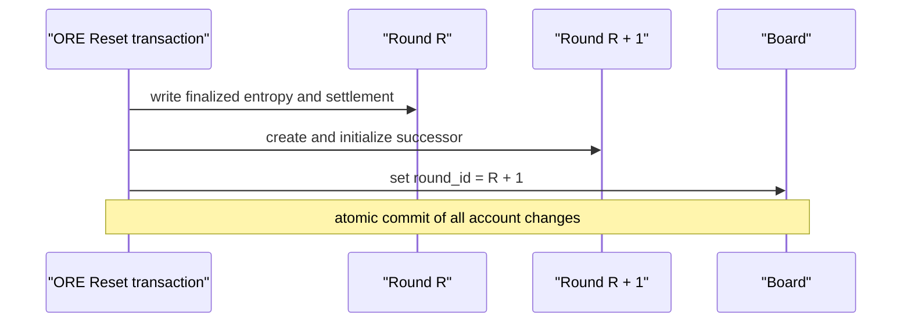

# Research Question 002 — Post-Transition Finalization

## Question

Would exactly one deterministic read of the predecessor Round account,
performed immediately after the observer recognizes that the Board has
advanced, materially improve local finalized-state observation?

## Executive finding

Yes. The protocol and repository evidence support a material improvement.

The ORE Reset instruction writes finalized state into the predecessor Round,
creates the successor Round, and advances `board.round_id` in one atomic Solana
transaction. A confirmed Board response that contains the successor therefore
corresponds to a committed protocol state in which the predecessor has already
been finalized. The predecessor account is not made immediately unavailable:
it is eligible for closure only after its separately recorded one-day expiry.

The current observer instead reads the Board, selects the successor Round from
that response, and never reads the predecessor again. In the fixed current-
session dataset population, 388 outcomes were later recovered by historical
enrichment after being missed locally. Those 388 are the evidence-bounded
theoretical conversion candidates for a single post-transition predecessor
read. Across the whole managed dataset, 1,106 enriched outcomes are the broader
upper bound, but older collection histories do not provide equally controlled
transition evidence.

No existing artifact records the result of an actual immediate predecessor
read. The realized recovery fraction therefore cannot be measured from the
available data. In addition, the observer's separate confirmed RPC requests do
not preserve the Board response's context slot for the subsequent account read.
These limitations reduce precision but do not alter the protocol ordering or
the size of the demonstrated opportunity.

## Scope and methodology

This investigation was read-only. It did not modify code, rebuild a dataset,
change or signal the observer, or issue experimental RPC traffic.

The analysis used:

- the observer control flow in `src/orev3/observer/collect.py`;
- RPC commitment and response handling in `src/orev3/observer/rpc.py`;
- the existing raw file `data/raw/observer_2026-08-01.jsonl`;
- transition events in `logs/collector_events_2026-08-01.jsonl`;
- the existing managed artifact `data/derived/replay_dataset_v1.jsonl`;
- the pinned official ORE revision
  [`3112ab78a64f92892a70d5d4cbd17e1d14b1c2fe`](https://github.com/regolith-labs/ore/tree/3112ab78a64f92892a70d5d4cbd17e1d14b1c2fe);
  and
- official [Solana transaction](https://solana.com/docs/core/transactions) and
  [account RPC](https://solana.com/docs/rpc/http/getaccountinfo)
  documentation.

The controlled timing population contains 405 managed rounds associated with
observer session `e24fb13b-8bf6-4d28-954c-4f169c15da32`, rounds `352008`
through `352412`. It contains 404 adjacent transitions for which both raw
snapshots and a structured transition event exist. Of their predecessor rounds,
387 are classified `enriched` and 17 are classified `observed`. The final
managed round, `352412`, is also enriched and has a transition in later raw
data, giving 388 current-session enriched candidates in total.

For each transition, the investigation identified:

1. the predecessor's final raw observation;
2. its `end_slot` and final sampled RPC slot;
3. the successor's first raw observation;
4. the structured transition-event timestamp;
5. the managed outcome source; and
6. the protocol state changes that must precede a successor Board value.

The analysis does not treat the local `observed_at_utc` timestamp as an RPC
completion time. `collect_snapshot()` assigns it before any RPC request
(`src/orev3/observer/collect.py:48-52`). It is used only for observed ordering
and elapsed-time bounds.

## Protocol analysis

### Reset establishes final state before the successor governs

The pinned official
[Reset handler](https://github.com/regolith-labs/ore/blob/3112ab78a64f92892a70d5d4cbd17e1d14b1c2fe/program/src/reset.rs)
establishes the relevant ordering:

1. Reset requires `clock.slot >= board.end_slot + INTERMISSION_SLOTS` at
   lines 22–25.
2. It validates the predecessor Round against the current `board.round_id` at
   lines 29–35.
3. It creates and initializes the successor Round at lines 46–66.
4. It copies the finalized entropy value into `round.slot_hash` at lines 90–94.
5. In the ordinary settlement path it writes `total_winnings` and
   `total_vaulted` at lines 177–186 and the other reward outcome fields before
   emitting the Reset event.
6. It increments `board.round_id` and resets the Board for the successor at
   lines 305–308.

The no-random-value and empty-winning-square branches also update the
predecessor outcome state before incrementing `board.round_id` at lines 95–129
and 138–174 respectively.

Solana processes the instruction's account mutations atomically: all state
changes commit or all revert. Therefore the successful Reset state that exposes
Board round `R + 1` also contains the Reset writes to predecessor Round `R`.
There is no valid committed intermediate state in which Reset has advanced the
Board but has not yet written the predecessor's finalized state.



### The predecessor remains available

The official Deploy handler sets `round.expires_at` to
`board.end_slot + ONE_DAY_SLOTS` when a round begins
([`deploy.rs`, lines 53–56](https://github.com/regolith-labs/ore/blob/3112ab78a64f92892a70d5d4cbd17e1d14b1c2fe/program/src/deploy.rs#L53-L56)).
The official Close handler requires both `round.id < board.round_id` and
`round.expires_at < clock.slot` before closing it
([`close.rs`, lines 19–23](https://github.com/regolith-labs/ore/blob/3112ab78a64f92892a70d5d4cbd17e1d14b1c2fe/program/src/close.rs#L19-L23)).

Thus Board advancement alone does not remove the predecessor account. An
immediate post-transition read is after finalization should exist and far before
the protocol's normal expiry boundary.

### Observer ordering

The observer performs three separate confirmed reads:

1. `getSlot`;
2. `getMultipleAccounts` for Board and Treasury; and
3. `getAccountInfo` for the Round PDA selected from the decoded Board.

The selection occurs at `src/orev3/observer/collect.py:84-90`. Transition
detection occurs later, after the selected snapshot has been written, at lines
218–242. As established in the preceding transition investigation, no
predecessor account read follows that detection.

The local RPC wrapper requests `commitment = "confirmed"` for both account
methods (`src/orev3/observer/rpc.py:189-221`) but returns only `result["value"]`.
It discards the response context and supplies no `minContextSlot`. Official
Solana RPC documentation exposes both a response context and a
`minContextSlot` request field. Consequently, the existing evidence cannot
prove that an additional unconstrained request would always be served from the
same or a later confirmed bank than the Board response.

## Timing evidence

### Aggregate transition timing

Across the 404 controlled adjacent transitions:

| Measurement | Minimum | Median | 95th percentile | Maximum |
| --- | ---: | ---: | ---: | ---: |
| Last predecessor to first successor observation | 1.000035 s | 1.010049 s | 1.010125 s | 6.236365 s |
| First successor observation to transition event | 0.093902 s | 0.155361 s | 0.282621 s | 1.243991 s |
| Last predecessor RPC slot minus `end_slot` | 31 slots | 33 slots | 34 slots | 36 slots |

The pinned ORE constant `INTERMISSION_SLOTS` is 35
([`consts.rs`, line 41](https://github.com/regolith-labs/ore/blob/3112ab78a64f92892a70d5d4cbd17e1d14b1c2fe/api/src/consts.rs#L41)).
The typical final predecessor poll therefore occurs just before Reset becomes
eligible. The next one-second iteration sees the successor Board, after the
Reset transaction has committed. A hypothetical read inserted after transition
detection would follow the successor observation by a median of roughly 155
milliseconds in the current control flow.

### Representative enriched transitions

| Predecessor → successor | Predecessor `end_slot` | Last predecessor observation | Last slot minus end | First successor observation | Poll gap | Event delay | Classification |
| --- | ---: | --- | ---: | --- | ---: | ---: | --- |
| 352008 → 352009 | 436502592 | `05:35:14.955332Z` | +32 | `05:35:15.955833Z` | 1.000501 s | 0.164525 s | enriched |
| 352011 → 352012 | 436503150 | `05:39:12.305644Z` | +34 | `05:39:13.315692Z` | 1.010048 s | 0.187037 s | enriched |
| 352208 → 352209 | 436539817 | `09:56:52.384584Z` | +34 | `09:56:53.394651Z` | 1.010067 s | 0.155235 s | enriched |
| 352411 → 352412 | 436577589 | `14:22:57.297425Z` | +33 | `14:22:58.302437Z` | 1.005012 s | 0.191656 s | enriched |

For each example, the last predecessor snapshot lacks the explicit finalized
indicators used by the repository. The first successor snapshot proves that a
successful Reset has advanced the Board. Under the atomic protocol transition,
the hypothetical predecessor read after that successor snapshot would occur
after predecessor finalization should already exist and well before normal
account expiry.

```mermaid
sequenceDiagram
    participant PollN as "Poll N"
    participant Chain as "Confirmed protocol state"
    participant PollNext as "Poll N + 1"
    participant Hyp as "Hypothetical single read"

    PollN->>Chain: Board R; read Round R without final indicators
    Chain->>Chain: atomic Reset finalizes R and advances Board to R + 1
    PollNext->>Chain: Board R + 1; read Round R + 1
    PollNext->>PollNext: detect R -> R + 1
    Hyp->>Chain: read predecessor Round R
    Note over Hyp,Chain: protocol state should already contain final R
```

### Observed controls and the inter-request window

Rounds `352009` and `352390` provide useful controls. Their final predecessor
snapshots are locally `observed`, and each is followed by the successor roughly
six seconds later. For round `352009`, the snapshot's initial `getSlot` result
is `end_slot + 34`, while the Round payload already contains finalized entropy
and settlement fields and the Board payload still identifies `352009`.

This combination is consistent with Reset committing between the separate
Board and Round-account requests: the Board response reflects the predecessor,
while the later Round response reflects finalized predecessor state. It shows
that the existing observer currently captures some outcomes through the narrow
inter-request timing window. It does not contradict atomic protocol state,
because the two account responses are not obtained from one atomic RPC
snapshot.

The roughly six-second successor gap for observed controls includes execution
of the durable writer's historical duplicate scan before the loop can continue;
it cannot be interpreted as protocol finalization delay. Enriched transitions,
which do not enter the finalized write path, typically retain the one-second
poll interval.

## Theoretical recovery estimate

### Evidence-bounded current-session estimate

The existing managed dataset contains 405 current-session rounds:

| Outcome source | Count |
| --- | ---: |
| Observed | 17 |
| Enriched | 388 |
| Missing | 0 |

All 388 enriched outcomes are theoretical candidates to become locally
observed because:

- their local timelines lacked finalized state;
- their Boards subsequently advanced;
- the protocol writes predecessor finalization before exposing that successor
  Board state; and
- historical enrichment later read a finalized predecessor account.

Therefore the evidence-bounded theoretical maximum is **388 additional
observed outcomes** in this session population. If every candidate converted,
the population would change from 17 observed and 388 enriched to 405 observed
and zero enriched. This is an upper bound, not a measured yield.

### Dataset-wide upper bound

The whole managed replay dataset contains:

| Outcome source | Count |
| --- | ---: |
| Observed | 638 |
| Enriched | 1,106 |
| Missing | 6,375 |

The dataset-wide theoretical upper bound is therefore **1,106 enriched
outcomes**. Confidence is lower for applying the current-session transition
finding to all 1,106 because the historical records span different sessions,
coverage patterns, and collection conditions.

The 6,375 currently missing outcomes are not included in either theoretical
conversion estimate. Existing evidence does not prove that those accounts had
a recoverable finalized state at collection time, and no outcome is available
to validate a hypothetical read.

## Confidence and limitations

| Finding | Confidence | Basis |
| --- | --- | --- |
| Reset finalizes the predecessor before advancing the Board | High | Direct pinned program source plus atomic Solana transaction semantics |
| The predecessor remains readable immediately after Reset | High | Reset does not close it; Close is gated by one-day expiry |
| Current observer omits the post-transition predecessor read | High | Direct local control-flow evidence |
| A single post-transition read has 388 current-session theoretical candidates | High | Exact managed outcome-source count and paired transition evidence |
| The read would recover a material fraction of those candidates | Moderate to high | Atomic ordering, immediate timing, long account lifetime, and later successful enrichment |
| Exact realized recovery count or percentage | Low / not measurable | No actual immediate predecessor reads exist in the artifacts |

Specific limitations are:

1. No existing raw record captures the result of the proposed read at the exact
   transition instant.
2. Separate confirmed RPC calls are not tied to one response context in the
   current wrapper; a one-shot follow-up can theoretically receive an older
   account view or fail operationally.
3. Local timestamps precede RPC completion and do not identify the precise
   on-chain Reset execution time.
4. Later enrichment proves eventual finalized-account availability, not the
   exact latency at which each RPC provider first served it.
5. The 388 figure is an upper bound for the fixed managed current-session
   population, not a forecast with a measured success probability.
6. Missing outcomes have no recovered ground truth and cannot be counted as
   likely conversions.

## Conclusion

The protocol guarantees that successful Board advancement and predecessor
finalization are part of the same atomic Reset transition, while the
predecessor account remains open far beyond the transition. Representative raw
timings place the omitted read immediately after Reset should have produced
finalized state. The separate enrichment path later recovered 388 such
current-session outcomes, demonstrating a material population that the normal
observer missed.

The available evidence cannot provide an exact realized recovery rate because
no immediate post-transition predecessor reads were recorded and the current
RPC wrapper does not preserve cross-call context. Nevertheless, protocol
ordering, account lifetime, observed timing, and later enrichment jointly
support the permitted affirmative conclusion.

**Evidence supports implementing one post-transition predecessor read.**
