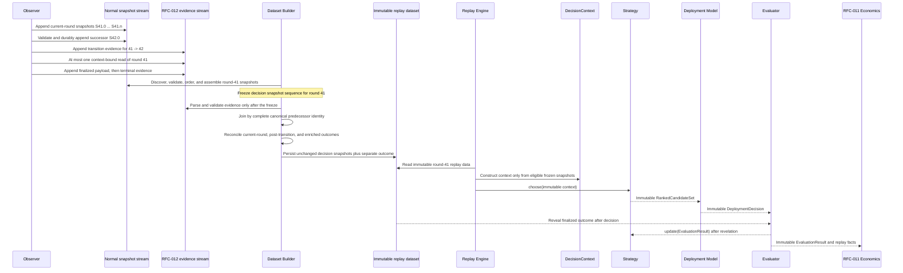
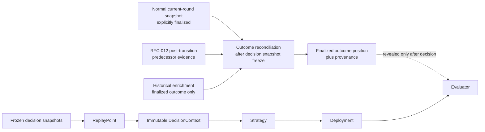

# RFC-012 Phase 3 Implementation Walkthrough

## 1. Purpose

This walkthrough follows one representative replay round through the
RFC-010, RFC-011, and RFC-012 architecture. Its purpose is to establish the
precise boundary between decision-time state and finalized-outcome evidence
before RFC-012 Phase 3 is implemented.

The governing documents are:

- [RFC-010 — Deterministic Strategy Laboratory](../../rfcs/RFC-010-STRATEGY-LAB.md);
- [RFC-011 — ORE Deployment Economics](../../rfcs/RFC-011-ORE-DEPLOYMENT-ECONOMICS.md);
- [RFC-012 — Observer Post-Transition Finalization Capture](../../rfcs/RFC-012-OBSERVER-FINALIZATION-CAPTURE.md); and
- [RFC-012 Implementation Plan](RFC-012-IMPLEMENTATION-PLAN.md).

This is a design walkthrough, not an implementation specification. It adds no
responsibility beyond the frozen RFC-012 Implementation Plan.

## 2. Representative round and two timelines

Let `R = 41` be the representative predecessor round and `R + 1 = 42` its
successor. During round 41, the Observer records normal current-round
snapshots `S41.0 ... S41.n`. When the Board later advances to round 42, the
Observer durably records successor snapshot `S42.0` and RFC-012 may perform its
one context-bound observation of the round-41 account.

Two timelines must not be conflated:

1. **Collection time:** raw observations and RFC-012 evidence are acquired.
2. **Build and replay time:** the Dataset Builder constructs an immutable
   dataset, and the Replay Engine later creates a `DecisionContext` from that
   dataset.

The post-transition read occurs before a later offline dataset build in wall
clock time. That fact does not make its payload decision-time information.
The safety property comes from source separation and the Dataset Builder's
post-freeze outcome join, not from when the offline build happens.

## 3. End-to-end sequence

The evidence stream never becomes an input to the Replay Engine's snapshot
selection or `DecisionContext` construction.

## 4. Lifecycle walkthrough

### 4.1 Current-round Observer collection

For round 41, the Observer repeatedly reads the Board-selected current Round
and emits normal snapshots.

| Property | Walkthrough value |
| --- | --- |
| Inputs | Board, Treasury, and Board-selected round-41 account responses with their observation context |
| Outputs | Chronologically ordered normal snapshots `S41.0 ... S41.n` |
| Immutable artifacts | Every append-only raw snapshot once written |
| Owner | Existing Observer current-round path |
| Still allowed to change | Later observations may append new snapshots while round 41 remains current; no prior snapshot changes |
| Permanently frozen | Bytes, timestamp, RPC slot, Board, Treasury, Round state, session identity, source order, and source identity of every written snapshot |

The normal snapshot may contain only what was observed at that observation.
An explicitly finalized normal snapshot may also provide the current-round
outcome source, but finalized fields remain outcome facts and are not
predictive inputs.

### 4.2 Lifecycle assembly

The Dataset Builder reads the normal snapshot source and groups snapshots by
their round identity. For round 41 it validates structure and chronology and
constructs the ordered decision-time history from `S41.0 ... S41.n`.

| Property | Walkthrough value |
| --- | --- |
| Inputs | Normal current-round snapshots only for decision-history construction |
| Outputs | One validated round-41 lifecycle with an ordered decision snapshot sequence and a distinct outcome position |
| Immutable artifacts | Accepted source snapshots and their canonical order |
| Owner | Existing lifecycle assembly and Dataset Builder behavior; Phase 3 owns only the RFC-012 outcome-source boundary |
| Still allowed to change | During construction, the builder may reject invalid inputs and may assemble a new output artifact; it may not mutate source snapshots |
| Permanently frozen | Once the decision sequence is materialized, its snapshot membership, contents, order, timestamps, and identities |

Lifecycle assembly does not authorize post-transition evidence to become a
snapshot. RFC-012 evidence is discovered through a separate source and is not
considered while the decision snapshot sequence is being assembled.

### 4.3 DecisionContext construction

At experiment time, the Replay Engine selects an observation at or before the
requested decision boundary from the frozen round-41 snapshot sequence. It
constructs the strategy-visible `DecisionContext` from that selected replay
point.

| Property | Walkthrough value |
| --- | --- |
| Inputs | Frozen normal snapshot sequence and the deterministic decision boundary |
| Outputs | One strategy-safe `ReplayPoint`, then one `DecisionContext` |
| Immutable artifacts | Selected replay point and the context's deeply immutable information mapping |
| Owner | RFC-010 Replay Engine and `DecisionContext` |
| Still allowed to change | Nothing within the emitted context; a later replay step may create another independent context |
| Permanently frozen | All fields visible to `Strategy.choose()` for this decision |

The Replay Engine selects only observations whose RPC slot is at or before the
requested boundary. Its replay point deliberately excludes finalized-outcome
metadata. `DecisionContext` exposes neither replay internals nor an outcome
field.

### 4.4 DecisionContext freeze

The runtime context becomes immutable when construction of the
`DecisionContext` completes, before it is passed to `Strategy.choose()`.
Its nested mappings and sequences are copied into deeply immutable values.

This runtime freeze is downstream of the Dataset Builder freeze described in
Section 5. The two freezes reinforce the same invariant:

- the Dataset Builder freezes which historical observations can supply a
  decision; and
- `DecisionContext` freezes the exact strategy-visible projection of the
  selected observation.

After `Strategy.choose()` begins, neither outcome attachment nor any other
component may alter the context, replay point, or ranked decision already
produced.

### 4.5 Post-transition predecessor evidence creation

Operationally, the Board later advances from 41 to 42. The accepted successor
snapshot `S42.0` is validated and durably persisted first. RFC-012 then records
transition evidence and, when eligible, performs at most one context-bound
observation of the canonical round-41 account.

| Property | Walkthrough value |
| --- | --- |
| Inputs | Previously accepted round 41, durable successor snapshot `S42.0`, exact Board response context, canonical predecessor identity, and durable finalized history |
| Outputs | Immutable transition evidence; optionally a durable finalized round-41 payload; one immutable terminal evidence record |
| Immutable artifacts | Transition, response, payload, and evidence identities and their canonical encodings |
| Owner | RFC-012 Phase 1 contracts and Phase 2 processor/persistence boundary |
| Still allowed to change | Only append-only evidence history may grow; accepted snapshots never change |
| Permanently frozen | Successor snapshot, predecessor identity, transition context, response payload, validation result, provenance, and terminal disposition once appended |

This payload is explicitly not a contemporaneous snapshot. It supplies no
Board, Treasury, or decision-time Round state for round 41 or 42. It can only
be evidence about the finalized outcome of round 41.

### 4.6 Dataset Builder consumption

Phase 3 consumes the Phase 2 evidence source only after the round-41 decision
snapshot sequence has been frozen. It validates schema, producer, transition,
response, payload, protocol, finality, and canonical predecessor identity.
The join key is the complete predecessor identity—not timestamp proximity,
file order, or successor round alone.

| Property | Walkthrough value |
| --- | --- |
| Inputs | Frozen round-41 lifecycle, separately discovered RFC-012 evidence, current-round outcome evidence, and any existing historical enrichment result |
| Outputs | One deterministic outcome reconciliation result for round 41 |
| Immutable artifacts | Frozen decision snapshot sequence and all source evidence identities |
| Owner | RFC-012 Phase 3 |
| Still allowed to change | The builder may populate the separate outcome/evaluation position and its provenance in the new dataset artifact |
| Permanently frozen | Every decision snapshot field and identity; rejected evidence cannot modify any artifact |

Only evidence with disposition `finalized_persisted`, explicit protocol
finality, matching raw and decoded payloads, supported identities, and no
conflicting outcome may be accepted. Failure to establish any required
relationship fails closed.

### 4.7 Outcome attachment

Accepted post-transition evidence contributes only finalized outcome fields to
the existing outcome/evaluation position for round 41.

The deterministic source rules are:

| Available evidence | Canonical outcome classification |
| --- | --- |
| Agreeing current-round and post-transition observations | `observed` with capture mode `current_round`; supplementary RFC-012 identity retained for audit |
| Post-transition observation only | `observed` with capture mode `post_transition_predecessor` |
| Enrichment only | `enriched`; never relabeled as local observation |
| Agreeing post-transition observation and enrichment | Local `observed` result is canonical; enrichment remains noncanonical supporting evidence |
| No finalized source | Missing outcome |
| Any canonical payload conflict | Dataset construction fails closed |

| Property | Walkthrough value |
| --- | --- |
| Inputs | Validated reconciliation result |
| Outputs | Finalized round-41 outcome plus immutable source/capture provenance, or an explicit missing outcome |
| Immutable artifacts | Attached outcome and provenance in the newly produced dataset |
| Owner | Existing outcome position, extended narrowly by RFC-012 Phase 3 provenance rules |
| Still allowed to change | Nothing after the dataset artifact is finalized; a future rebuild creates a new immutable artifact rather than mutating this one |
| Permanently frozen | Outcome payload, source, capture mode, supporting evidence identity, and missing/available status for this dataset version |

No outcome source is copied into a replay snapshot or strategy-visible field.

### 4.8 Replay dataset persistence

The Dataset Builder writes an immutable replay artifact whose structure keeps
decision snapshots and finalized outcomes in distinct semantic positions.

| Property | Walkthrough value |
| --- | --- |
| Inputs | Frozen round-41 snapshot sequence and reconciled outcome position |
| Outputs | Persisted replay lifecycle/index record and its immutable dataset metadata/identity |
| Immutable artifacts | Dataset version, snapshot references and order, finalized outcome, provenance, completeness status, and integrity identity |
| Owner | Dataset persistence and validation |
| Still allowed to change | Nothing in the persisted dataset during an experiment; a rebuild produces a separately identified artifact |
| Permanently frozen | Complete persisted record and metadata for that dataset version |

Although snapshots and outcomes coexist in the historical dataset, RFC-010
interfaces determine when each is visible. Replay reconstruction reads the
snapshot side. The Evaluator receives the outcome side only after Strategy and
Deployment have emitted immutable decisions.

## 5. The exact freeze boundary

The authoritative Phase 3 freeze boundary is:

> **For predecessor round `R`, decision-time state becomes immutable after the
> Dataset Builder has validated, canonically ordered, and materialized the
> complete normal current-round decision snapshot sequence, and before it
> discovers, parses, joins, or reconciles any post-transition or enrichment
> outcome evidence.**

That boundary must be represented by an immutable value or byte-stable
artifact whose identity can be compared before and after outcome attachment.
It is not merely a statement that the builder promises not to mutate a mutable
object.

After this point RFC-012 is permitted to affect only:

- the finalized outcome/evaluation position for round `R`;
- broad outcome source (`observed` or `enriched`);
- local capture mode (`current_round` or
  `post_transition_predecessor`);
- completeness metadata derived from outcome availability; and
- supplementary immutable audit identities.

RFC-012 is not permitted to change:

- snapshot membership, bytes, count, or ordering;
- observation timestamps, RPC slots, or source references;
- Board, Treasury, or decision-time Round state;
- replay selection boundaries or replay chronology;
- `ReplayPoint` content;
- `DecisionContext` fields or bytes;
- Strategy input or pre-outcome Strategy state;
- Ranked Candidate Sets or Deployment Decisions; or
- RFC-010 and RFC-011 outcome-revelation semantics.

At runtime, a second exact freeze occurs when the immutable
`DecisionContext` constructor returns. The context is then passed unchanged to
`Strategy.choose()`.

## 6. The outcome-only convergence boundary

Three sources may establish a finalized outcome:

The three sources converge only inside outcome reconciliation. None is an
input to snapshot ordering, replay-point selection, or `DecisionContext`
construction.

## 7. Future-information proof by component

### Replay

Replay consumes only the frozen normal snapshot sequence when reconstructing
historical state. Snapshot counts, contents, identities, and ordering must be
byte-equivalent with and without RFC-012 evidence. Post-transition evidence is
not represented as a replay snapshot, so it cannot become eligible for
selection at a decision slot.

### DecisionContext

`DecisionContext` is constructed exclusively from the selected strategy-safe
replay point. It has no finalized outcome, winner, post-transition evidence,
capture mode, enrichment payload, or replay-internal field. Phase 3 must prove
that its serialized strategy-visible input is byte-equivalent whether the
round-41 outcome is missing, current-round observed, post-transition observed,
or enriched.

### Strategy

Strategy receives only the immutable `DecisionContext`. It cannot access
persistence, replay internals, or outcome evidence. A stateful Strategy may be
updated only after the Evaluator reveals the completed outcome for the current
round. Therefore round-41 outcome evidence cannot influence the round-41
choice.

### Deployment

The Deployment Model consumes the already immutable `RankedCandidateSet`, not
the dataset outcome. It expresses conviction without reading replay data or
historical outcomes. Changing round-41 outcome provenance cannot change the
round-41 Deployment Decision.

### Evaluation

Evaluation is the authorized outcome-revelation boundary. It intentionally
receives the finalized outcome, but only after Strategy and Deployment have
produced immutable round-41 decisions. The safety property is therefore not
that Evaluation lacks future information; it is that Evaluation cannot expose
that information backward into the decision pipeline or modify replay,
Strategy, or Deployment state. Its immutable result may be passed to
`Strategy.update()` only after the current decision has been evaluated.

RFC-011 remains downstream of the same boundary. It consumes immutable replay
facts, Deployment Decision, and Evaluation Result; it neither enriches an
outcome nor implies that an observed or enriched outcome was available to the
Strategy at decision time.

## 8. Ownership and immutability summary

| Artifact | Architectural owner | Becomes immutable | May RFC-012 Phase 3 modify it? |
| --- | --- | --- | --- |
| Current-round raw snapshot | Observer | At append | No |
| Ordered decision snapshot sequence | Lifecycle assembly/Dataset Builder | Before any outcome-source reconciliation | No |
| Transition and post-transition evidence | RFC-012 Phases 1 and 2 | At durable append | No; Phase 3 only validates and reads it |
| Finalized outcome position | Dataset Builder outcome boundary | When the new dataset artifact is finalized | Phase 3 may populate it before finalization |
| Outcome source and capture mode | RFC-012 Phase 3 | With the finalized dataset artifact | Phase 3 may derive them deterministically before finalization |
| Replay dataset | Dataset persistence | At successful validated write | No |
| ReplayPoint | RFC-010 Replay Engine | At construction | No |
| DecisionContext | RFC-010 | At construction, before `Strategy.choose()` | No |
| RankedCandidateSet | RFC-010 Strategy | At return from `choose()` | No |
| DeploymentDecision | RFC-010 Deployment Model | At construction | No |
| EvaluationResult | RFC-010 Evaluator | After outcome revelation | No |
| EconomicRoundResult | RFC-011 Economics | After deterministic settlement | No |

## 9. Phase 3 implementation obligations established by the walkthrough

This walkthrough does not add requirements. It makes the frozen plan's proof
obligations concrete. Phase 3 must demonstrate that:

1. normal snapshots and RFC-012 evidence are discovered through distinct
   inputs;
2. the decision snapshot sequence is immutable before evidence parsing or
   outcome reconciliation;
3. only complete canonical predecessor identity can join evidence to round
   41;
4. accepted evidence changes only the outcome position and provenance;
5. snapshot and strategy-visible identities are byte-equivalent with and
   without RFC-012 evidence;
6. every source conflict fails closed;
7. missing outcomes remain missing; and
8. outcome revelation remains after immutable Strategy and Deployment
   decisions.

These obligations prove the core conclusion: post-transition predecessor
evidence can improve outcome completeness without becoming decision-time
information.
