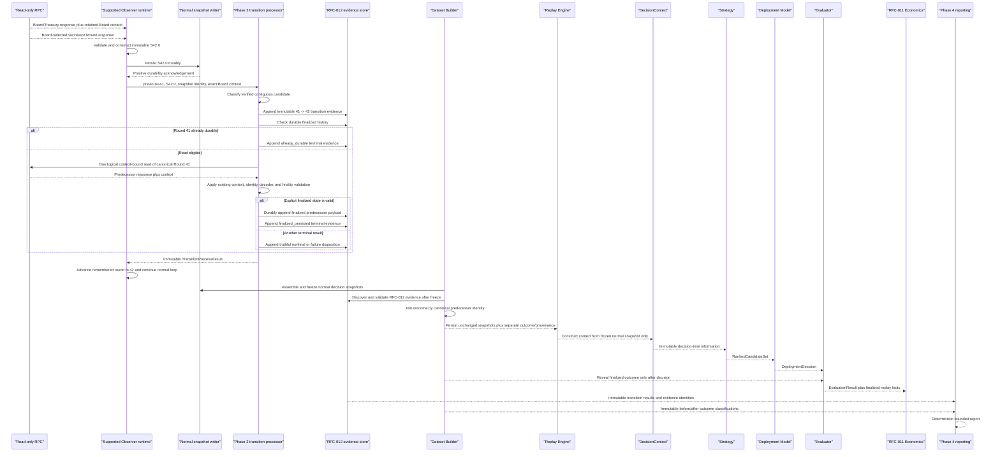
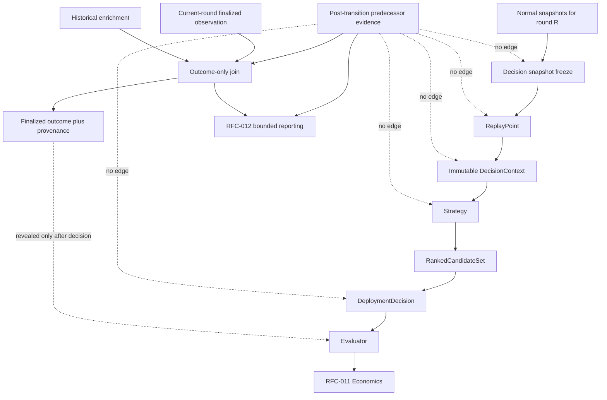

# RFC-012 Phase 5 Implementation Walkthrough

## 1. Purpose

This walkthrough follows one representative contiguous ORE transition through
the supported Observer runtime and the completed RFC-012 Phase 1–4 components.
Its purpose is to verify the Phase 5 integration boundary before implementation.

The governing documents are:

- [RFC-012 — Observer Post-Transition Finalization Capture](../../rfcs/RFC-012-OBSERVER-FINALIZATION-CAPTURE.md);
- [RFC-012 Implementation Plan](RFC-012-IMPLEMENTATION-PLAN.md); and
- [RFC-012 Phase 3 Implementation Walkthrough](phase3-walkthrough.md).

RFC-010 remains authoritative for Replay, `DecisionContext`, Strategy,
Deployment, and Evaluation. RFC-011 remains authoritative for economic
simulation. This walkthrough assigns no new responsibility to those systems.

## 2. Representative transition

Let the current Board-selected round be `R = 41`. The Observer has already
accepted and persisted normal current-round snapshots `S41.0 ... S41.n` and
remembers round identifier 41.

The next normal observation reads a Board response that identifies round 42.
That same response carries the Board context required by RFC-012. The Observer
then reads the Board-selected round-42 account and constructs successor snapshot
`S42.0`.

The representative successful branch is:

```text
normal observation S42.0
  -> durable successor persistence
  -> Phase 2 classifies 41 -> 42 as a verified contiguous transition
  -> transition evidence append
  -> exactly one context-bound read of canonical round 41
  -> explicit finalized state validates
  -> finalized predecessor payload append
  -> finalized_persisted terminal evidence append
  -> remembered round advances to 42
  -> normal loop continues
```

The `already_durable` branch stops after transition evidence and the history
check, performs zero predecessor reads, records `already_durable`, and then
continues through the same loop boundary.

## 3. Complete sequence



## 4. Runtime integration boundary

The supported continuous Observer entry point is
[`orev3.observer.collect.main`](../../../src/orev3/observer/collect.py). The
current loop collects a snapshot, calls `JsonlSnapshotWriter.write()`, evaluates
the remembered round, updates `previous_round_id`, and sleeps. The Phase 5
callsite belongs at exactly one point:

```text
collect and validate normal snapshot
  -> obtain exact Board response context that supplied its Board
  -> durably persist normal successor snapshot
  -> preserve the existing round_transition operational event behavior
  -> invoke the existing Phase 2 processor
  -> preserve the immutable result for existing reporting
  -> update previous_round_id
  -> print existing status
  -> sleep or exit
```

The call occurs after the successful write corresponding to
[`collect.py`](../../../src/orev3/observer/collect.py) lines 208–216 and before
the remembered-round update currently at lines 244–246. The existing
`round_transition` event block at lines 222–242 remains operational metadata at
its existing point; it neither supplies nor replaces RFC-012 transition
evidence. The Phase 2 call is also before the next iteration and its sleep.

Phase 5 must not copy the current loop's broad `round_id != previous_round_id`
test into a second RFC-012 classifier. The runtime supplies the existing Phase 2
processor with the previous identifier, successor snapshot and identity, exact
Board response context, successor validation result, and positive durability
result. Phase 2's `process()` method remains the sole owner of initial,
unchanged, contiguous, skipped, regressed, ambiguous, and invalid-successor
classification.

Consequently, the supported runtime may invoke the processor once for each
accepted and durably persisted normal observation. Noncandidate results consume
zero supplementary reads. A verified candidate is therefore invoked exactly
once, without moving candidate logic into the loop.

### 4.1 Exact Board context

The context passed to Phase 2 must be the non-secret response context from the
same Board response whose decoded Board selected `S42.0`. It cannot be obtained
from a later Board read, reconstructed from `snapshot.rpc_slot`, or synthesized
from wall-clock time.

The current normal path fetches Board and Treasury together but exposes only
the account values. The underlying Solana response also has context. Phase 5
wiring must retain that existing response context alongside the unchanged
`ObserverSnapshot`. Retaining it does not add a protocol decision or change the
snapshot schema; it satisfies the Phase 1 `TransitionContext` input contract.

### 4.2 Durable successor acknowledgement

The Phase 2 input `successor_durably_persisted` may be true only after the
normal snapshot writer positively establishes durable persistence. A returned
path alone is not sufficient evidence when the append was not fsynced.

The current `JsonlSnapshotWriter` uses `durable=True` automatically for an
explicitly finalized normal snapshot, while an ordinary active successor append
does not request fsync. Phase 5 must therefore wire an explicit durability
acknowledgement at the existing normal writer boundary before invoking Phase 2.
It may not create a second snapshot writer or claim durability speculatively.
This enforces RFC-012's established ordering; it adds no transition business
logic.

### 4.3 Read-only predecessor adapter

The runtime-side RPC adapter implements the already-defined Phase 2
`PredecessorReader` boundary. It forwards:

- the canonical predecessor PDA supplied by Phase 2;
- the retained Board commitment; and
- the Board context slot as `min_context_slot`.

It returns one `PredecessorObservation` containing response context, owner, raw
account payload, and pinned identities. Transport retries remain one logical
observation; the Phase 2 processor still receives one logical response or one
operational failure. The adapter performs no decoding, finality decision,
provider switch, or terminal classification.

### 4.4 Durable-history and evidence adapters

The runtime supplies:

- the existing finalized-history semantics used to prevent duplicate durable
  outcomes; and
- the existing `Rfc012EvidenceStore` producer/reader boundary discoverable by
  Phase 3.

Phase 5 creates no second identity rule, finalized writer, or evidence format.
The processor remains responsible for append ordering and the terminal result.

## 5. Stage-by-stage lifecycle

### 5.1 Normal Observer collection

| Property | Representative execution |
| --- | --- |
| Inputs | Read-only RPC client, Observer session identity, current Board/Treasury response, exact Board response context, and Board-selected round-42 response |
| Outputs | Immutable `S42.0` plus a runtime companion containing the exact non-secret Board context |
| Immutable artifacts | The constructed `ObserverSnapshot`; the response context values passed to Phase 1 contracts |
| Ownership | Existing Observer collection and decoding; Phase 5 only retains and carries the context |
| May still change | No durable state has changed until the writer succeeds; later iterations may create additional snapshots |
| Permanently frozen | The contents of `S42.0` and its source response once accepted; Phase 5 cannot add predecessor fields to it |

The current-round path remains Board-first: decode Board, derive the
Board-selected Round PDA, read that Round, and construct one normal snapshot.
RFC-012 does not replace or defer this path.

### 5.2 Successor snapshot persistence

| Property | Representative execution |
| --- | --- |
| Inputs | Accepted immutable `S42.0` |
| Outputs | Existing normal JSONL append and positive durability acknowledgement |
| Immutable artifacts | Exact normal snapshot bytes and source ordering after durable append |
| Ownership | Existing `JsonlSnapshotWriter`; Phase 5 enforces the sequencing at its boundary |
| May still change | Append-only normal history may receive later snapshots |
| Permanently frozen | Every previously written normal record, including `S42.0` |

If normal persistence fails or durability is not established, Phase 2 is not
allowed to perform supplementary work. The loop follows existing snapshot
failure handling.

### 5.3 Transition detection

| Property | Representative execution |
| --- | --- |
| Inputs | Remembered identifier 41, durable `S42.0`, successor snapshot identity, exact Board context, and validation/durability facts |
| Outputs | Phase 2 candidate status; for this walkthrough, `processed` for contiguous `41 -> 42` |
| Immutable artifacts | `TransitionProcessResult` once returned; transition identity when a candidate exists |
| Ownership | Phase 2 `Rfc012TransitionProcessor` |
| May still change | The Observer still remembers 41 until Phase 2 returns |
| Permanently frozen | Candidate inputs and the resulting classification |

Initial, unchanged, skipped, regressed, ambiguous, or invalid successor inputs
return their existing explicit status with zero supplementary reads and no
candidate evidence.

### 5.4 Phase 2 processor invocation

| Property | Representative execution |
| --- | --- |
| Inputs | Exact values listed in Section 5.3 plus configured reader, finalized history, evidence store, clock, and pinned decoder |
| Outputs | One immutable `TransitionProcessResult` containing zero or one observation count and, for a candidate, transition and terminal evidence |
| Immutable artifacts | Phase 1 identities and the returned Phase 2 result |
| Ownership | Phase 5 owns only dependency construction and the single call; Phase 2 owns behavior |
| May still change | Append-only evidence may grow in the fixed Phase 2 order |
| Permanently frozen | Every emitted contract and identity |

Phase 5 does not catch a result and reinterpret it. It preserves the returned
status, evidence, observation count, and disposition exactly.

### 5.5 Transition evidence persistence

| Property | Representative execution |
| --- | --- |
| Inputs | Session identity, canonical round-41 identity, successor round 42, successor snapshot identity, and retained Board context |
| Outputs | One append-only `TransitionEvidence` record keyed by deterministic transition identity |
| Immutable artifacts | Canonical predecessor identity, transition context, canonical encoding, and transition identity |
| Ownership | Phase 1 contract and Phase 2 evidence store |
| May still change | Later records may append after this record |
| Permanently frozen | Transition record bytes and identity |

This append precedes the durable-history lookup and any predecessor
observation.

### 5.6 Zero-or-one predecessor observation

| Property | Representative execution |
| --- | --- |
| Inputs | Canonical round-41 PDA, retained commitment and context slot, provider/network bindings, and durable finalized history |
| Outputs | Zero reads with `already_durable`, or one logical `PredecessorObservation` for a read-eligible candidate |
| Immutable artifacts | Response identity and preserved raw payload when a response exists |
| Ownership | Phase 2; Phase 5 supplies only the read-only adapter |
| May still change | No normal snapshot changes; Phase 2 may still select a terminal disposition |
| Permanently frozen | Logical observation count and response context/payload once returned |

No second read, background queue, restart recovery, provider switch, or
outcome-specific retry is introduced.

### 5.7 Finalized persistence when applicable

| Property | Representative execution |
| --- | --- |
| Inputs | Context-valid predecessor response, canonical account identity, owner/program/protocol/decoder bindings, raw payload, and explicitly decoded finality |
| Outputs | Durable finalized round-41 payload with `observed` / `post_transition_predecessor` provenance |
| Immutable artifacts | Raw and decoded payload hashes, protocol payload identity, and canonical predecessor binding |
| Ownership | Phase 2 through its existing finalized persistence boundary |
| May still change | Only the terminal evidence append remains |
| Permanently frozen | Durable finalized payload and its provenance |

Board advancement is not used as finality. `finalized_persisted` remains
impossible until this durable append succeeds.

### 5.8 Terminal disposition persistence

| Property | Representative execution |
| --- | --- |
| Inputs | Transition evidence, observation or absence, validation outcome, failure category when applicable, finalized-state determination, and durability result |
| Outputs | Exactly one immutable `PostTransitionEvidence` record and returned terminal disposition |
| Immutable artifacts | Response, evidence, payload, source, capture mode, and terminal identities |
| Ownership | Phase 2 |
| May still change | After the append, the normal Observer may update remembered round state and continue |
| Permanently frozen | Entire completed branch and its truthful terminal disposition |

A supplementary failure never removes or invalidates `S42.0`. Once Phase 2
returns, the existing loop advances `previous_round_id` to 42, prints status,
and continues its existing cadence. The pre-existing normal transition event
remains separate operational metadata.

### 5.9 Dataset Builder consumption

| Property | Representative execution |
| --- | --- |
| Inputs | Normal snapshot files, separately discovered RFC-012 evidence, and optional historical enrichment source |
| Outputs | Frozen normal round-41 lifecycle plus reconciled finalized outcome and canonical provenance |
| Immutable artifacts | Decision snapshot freeze, evidence identities, and resulting lifecycle/index record |
| Ownership | Phase 3; Phase 5 only validates the integrated output |
| May still change | During a build, only the separate outcome position in the new artifact may be populated |
| Permanently frozen | Snapshot membership/content/order before evidence parsing; complete dataset artifact after persistence |

The builder freezes normal snapshots before discovering or parsing RFC-012
evidence. It joins only by `CanonicalPredecessorIdentity`. In the representative
branch, round 41 becomes `observed` with capture mode
`post_transition_predecessor`, unless an agreeing current-round final is already
canonical. Conflicts fail closed.

### 5.10 Replay construction

| Property | Representative execution |
| --- | --- |
| Inputs | Persisted lifecycle's normal observation references and requested replay boundary |
| Outputs | Deterministically selected `ReplayPoint` at or before that boundary |
| Immutable artifacts | Loaded normal snapshots, selection, and replay point |
| Ownership | RFC-010 Replay Engine |
| May still change | Nothing inside the selected replay point; later rounds produce independent replay points |
| Permanently frozen | Selected strategy-visible historical observation |

Replay selection reads the unchanged normal snapshot sequence. Outcome source,
capture mode, and RFC-012 evidence identities do not become replay-point fields.

### 5.11 DecisionContext construction

| Property | Representative execution |
| --- | --- |
| Inputs | One immutable `ReplayPoint` |
| Outputs | One deeply immutable `DecisionContext` containing only historically available Board, Treasury, Round, slot, and timing information |
| Immutable artifacts | Context mapping and nested values |
| Ownership | RFC-010 Strategy Lab runner and interfaces |
| May still change | Nothing within this context; strategy state may change only under its defined lifecycle |
| Permanently frozen | Every value visible to `Strategy.choose()` |

The context projection has no finalized outcome, provenance, capture mode, or
RFC-012 evidence field.

### 5.12 Strategy

| Property | Representative execution |
| --- | --- |
| Inputs | Immutable `DecisionContext` only |
| Outputs | Immutable `RankedCandidateSet` and strategy-owned explanations |
| Immutable artifacts | Ranked candidates, ordering, scores, and explanations |
| Ownership | RFC-010 Strategy interface and selected Strategy implementation |
| May still change | Deterministic internal strategy state only through the existing lifecycle; outcome update occurs after evaluation |
| Permanently frozen | The decision for round 41 |

Post-transition evidence is unreachable from the Strategy interface.

### 5.13 Deployment

| Property | Representative execution |
| --- | --- |
| Inputs | Immutable `RankedCandidateSet` |
| Outputs | Immutable `DeploymentDecision` |
| Immutable artifacts | Ordered allocation set and deployment-model metadata |
| Ownership | RFC-010 Deployment Model |
| May still change | Nothing in the emitted decision |
| Permanently frozen | Abstract allocation decision used by Evaluation and RFC-011 |

Deployment does not read replay facts or RFC-012 evidence.

### 5.14 Evaluation

| Property | Representative execution |
| --- | --- |
| Inputs | Frozen `DeploymentDecision` and the separately attached finalized round-41 outcome revealed after the decision |
| Outputs | Immutable `EvaluationResult` containing the factual winning-square comparison |
| Immutable artifacts | Evaluation observation, decision, hit/miss, and winning allocation |
| Ownership | RFC-010 Evaluator |
| May still change | Strategy may receive its existing post-outcome update; the evaluation itself does not change |
| Permanently frozen | Factual evaluation for this decision |

RFC-012 can improve outcome availability, but it does not change when the
Evaluator receives that outcome or how hit status is calculated.

### 5.15 RFC-011 Economics

| Property | Representative execution |
| --- | --- |
| Inputs | Existing RFC-010 experiment identity, ordered `DeploymentDecision` and `EvaluationResult`, finalized replay facts and provenance, immutable economic scenario, and participant state |
| Outputs | Ordered `EconomicRoundResult`, deterministic metrics, and immutable `EconomicSimulationRecord` |
| Immutable artifacts | Economic scenario, per-round results, state identities, metrics, and record identity |
| Ownership | RFC-011 Allocation, Constraints, Transactions/Inclusion, Settlement, Runner, Metrics, and Record layers |
| May still change | Participant state advances only through existing deterministic settlement between rounds |
| Permanently frozen | Every completed round result and terminal simulation record |

RFC-012 supplies no economic rule. RFC-011 receives the same outcome and
provenance shape already supported by its observed/enriched/missing semantics.

### 5.16 RFC-012 reporting

| Property | Representative execution |
| --- | --- |
| Inputs | Immutable Phase 2 transition results, immutable Phase 3 baseline and reconciled lifecycles, and one immutable half-open effectiveness window |
| Outputs | Deterministic operational aggregates, effectiveness metrics, conformance assessment, and report identity |
| Immutable artifacts | Window identity, source identities, exact rates, disposition counts, provenance/capture distributions, and canonical report bytes |
| Ownership | Phase 4; Phase 5 exposes the immutable output only through an already-supported reporting mechanism |
| May still change | A later bounded window creates a different report; an existing report never changes |
| Permanently frozen | Complete bounded report and identity |

Reporting performs no RPC call and reads no mutable loop counter. Enrichment
avoided is counted only by comparing the same bounded dataset build before and
after Phase 3 reconciliation where the baseline was `enriched` and the accepted
result is local `post_transition_predecessor`. Measured effectiveness never
changes conformance status.

## 6. State and freeze boundaries

The integrated lifecycle has four distinct freeze boundaries:

1. **Normal snapshot freeze:** `S42.0` becomes immutable when constructed and
   durable when the existing writer positively acknowledges persistence.
2. **Transition branch freeze:** transition evidence freezes before any
   supplementary read; finalized payload freezes before `finalized_persisted`;
   terminal evidence freezes the completed branch.
3. **Dataset decision freeze:** normal round-41 snapshots are validated,
   canonically ordered, and hashed before any RFC-012 evidence is discovered or
   parsed. Afterward only the separate outcome/provenance position may change in
   the new dataset artifact.
4. **Strategy input freeze:** `DecisionContext` becomes deeply immutable when
   constructed and before `Strategy.choose()`.

The remembered Observer round identifier is not outcome evidence. It updates
from 41 to 42 only after the Phase 2 call completes, ensuring the supplementary
branch occurs before the next normal iteration while never rewriting either
normal snapshot.

## 7. Failure paths

Every Phase 2 candidate branch terminates explicitly:

| Condition | Read count | Durable successor preserved | Terminal result |
| --- | ---: | --- | --- |
| Existing valid finalized predecessor | 0 | Yes | `already_durable` |
| Explicit valid finalized response and durable append | 1 | Yes | `finalized_persisted` |
| Explicit valid but nonfinal response | 1 | Yes | `not_finalized` |
| Account absent | 1 | Yes | `account_unavailable` |
| Response context cannot be proven | 1 | Yes | `context_unproven` |
| Identity, owner, protocol, decoder, or payload ambiguity | 0 or 1, depending on where detected | Yes | `invalid_or_ambiguous` |
| Read or persistence operation fails | 1 when the read was submitted; otherwise 0 | Yes | `operational_failure` |

Initial, unchanged, skipped, regressed, ambiguous-transition, or invalid
successor observations remain noncandidate results with zero supplementary
reads. They do not create a finalized outcome.

No failure path permits Phase 5 to retry, choose a different provider, infer
finality, reinterpret a disposition, or suppress the accepted successor.

## 8. Architectural proof

### 8.1 Phase 5 integrates existing components only

Phase 5 adds one supported-runtime callsite and dependency adapters. Each
behavior remains with its existing owner:

| Responsibility | Existing owner invoked by Phase 5 |
| --- | --- |
| Snapshot collection and current-round decoding | Existing Observer |
| Normal append and durability | Existing snapshot writer boundary |
| Candidate classification and one-read budget | Phase 2 |
| Context, identity, protocol, and finality validation | Phases 1 and 2 |
| Finalized and evidence append ordering | Phase 2 |
| Outcome-only dataset join and reconciliation | Phase 3 |
| Operational/effectiveness calculations | Phase 4 |
| Replay and `DecisionContext` | RFC-010 |
| Strategy, Deployment, and Evaluation | RFC-010 |
| Economic simulation | RFC-011 |

The integration layer may retain response context, construct configured
dependencies, invoke components, preserve immutable outputs, and route those
outputs to existing sinks. It may not decide candidate status, validate an RPC
response, calculate a report, or attach an outcome itself.

### 8.2 Existing current-round path is preserved

The Board still selects the normal current Round. The Observer still reads and
persists that snapshot before supplementary work. The predecessor branch never
replaces `S42.0`, never delays its persistence, never changes its contents, and
never invalidates it after a supplementary failure.

The only additional reachability begins after positive successor durability
and ends before the remembered-round update and next iteration.

### 8.3 Replay ordering is unchanged

Phase 2 evidence is stored outside the normal Observer snapshot stream. Phase 3
freezes the normal sequence before evidence discovery and verifies the freeze
after reconciliation. Replay continues to load normal observation references
and sort lifecycles under its existing rules. No RFC-012 evidence record is a
replay snapshot.

### 8.4 `DecisionContext` is unchanged

The Replay Engine continues to select an observation at or before the requested
boundary. The Strategy Lab continues to project only Board, Treasury,
current-round, slot, timing, and source-reference information. Outcome,
provenance, capture mode, evidence identity, transition identity, and response
context remain absent.

### 8.5 Strategy and Deployment are unchanged

Strategy receives the same immutable `DecisionContext` type and returns the
same `RankedCandidateSet` type. Deployment receives only ranked candidates and
returns the same immutable `DeploymentDecision`. RFC-012 adds no import,
argument, method, or state transition to either interface.

### 8.6 Evaluation ordering is unchanged

The finalized outcome remains unavailable until after Strategy and Deployment
have emitted immutable outputs. Phase 3 changes only whether an explicit
outcome is available and its provenance; it does not move outcome revelation
earlier. Evaluation uses its existing factual comparison.

### 8.7 RFC-011 Economics is unchanged

RFC-011 continues to consume existing deployment decisions, evaluation
results, replay facts, provenance, scenario, and participant state. RFC-012
does not alter allocation materialization, protocol constraints, transaction
modeling, inclusion, settlement, state transition, metrics, or record identity.

### 8.8 Reporting uses immutable evidence only

Phase 4 accepts immutable `TransitionProcessResult` values, immutable baseline
and reconciled lifecycles, and an immutable bounded window. It reconstructs
source identities, verifies the decision-snapshot freeze, reconciles terminal
and dataset classifications, and creates canonical report bytes. Phase 5 may
present that object through an existing reporting surface, but does not
recompute any count or rate.

## 9. No-future-information proof



The dashed “no edge” relationships are enforced structurally:

- post-transition records are not normal snapshots;
- Phase 3 opens evidence only after the decision snapshot freeze;
- replay points omit finalized outcome metadata;
- `DecisionContext` has no outcome or evidence field;
- Strategy accepts only `DecisionContext`;
- Deployment accepts only `RankedCandidateSet`; and
- Evaluation receives the finalized outcome only after the decision.

Therefore a successful Phase 5 integration can increase local finalized
outcome availability without changing any decision-time byte, replay ordering,
strategy-visible value, deployment, or RFC-011 economic rule.

## 10. Phase 5 implementation obligations established by this walkthrough

The walkthrough confirms that Phase 5 is integration-only, provided its tests
objectively prove:

1. the exact Board response context that supplied the successor Board is
   retained without a second Board read;
2. the successor normal snapshot receives a positive durability acknowledgement
   before Phase 2 is called;
3. the Phase 2 call occurs before `previous_round_id` update, sleep, or the next
   collection iteration;
4. the loop does not duplicate Phase 2 candidate, context, finality,
   persistence, or disposition logic;
5. candidate paths invoke Phase 2 exactly once and preserve Phase 2's zero-or-one
   logical read count;
6. every Phase 2 failure preserves the accepted successor and normal loop;
7. the existing normal transition event remains operational metadata rather
   than an RFC-012 authority source;
8. the Phase 3 build changes only outcome/provenance after the freeze;
9. Replay, `DecisionContext`, Strategy, Deployment, Evaluation, and RFC-011
   regression identities remain unchanged; and
10. Phase 4 reports reconstruct only from immutable source identities and no
    effectiveness percentage becomes a conformance gate.

No implementation conclusion in this walkthrough authorizes a production
Observer restart, live RPC test, dataset rebuild, CLI change, or production
operation.
